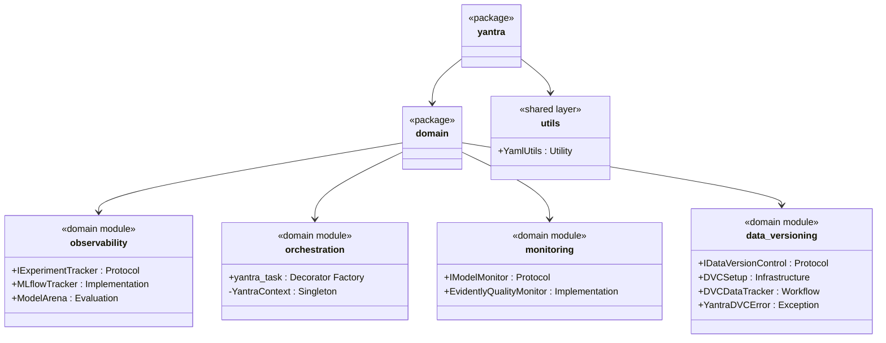
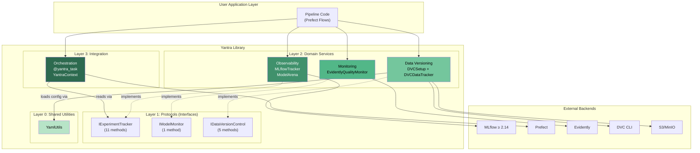
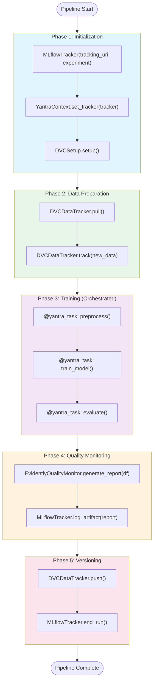
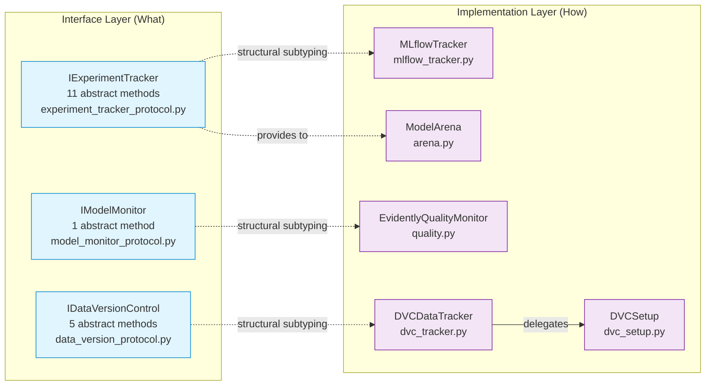
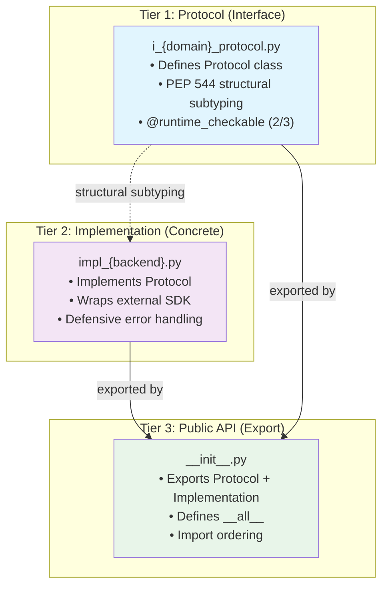

# Cross-Module Analysis — Architecture

## 1. Domain-Driven Internal Structure

The Yantra library is organized into a **domain-driven** package hierarchy where each module maps to a distinct MLOps concern. All domain modules reside under `src/nikhil/yantra/domain/` and share a uniform internal structure.

### Package Hierarchy

### Module Composition Table

*Caption: Each domain module's internal structure follows a consistent Protocol → Implementation → Export pattern. Source: `__init__.py` of each module.*

| S.No | Module | Protocol | Implementation(s) | Support Classes | Files | LOC | Public Exports |
|:---:|:---|:---|:---|:---|:---:|:---:|:---|
| 1 | `observability` | `IExperimentTracker` (11 methods) | `MLflowTracker`, `ModelArena` | — | 4 | 210 | 3 (`IExperimentTracker`, `MLflowTracker`, `ModelArena`) |
| 2 | `orchestration` | — (consumes `IExperimentTracker`) | `@yantra_task` | `YantraContext` (internal) | 3 | 96 | 1 (`yantra_task`) |
| 3 | `monitoring` | `IModelMonitor` (1 method) | `EvidentlyQualityMonitor` | — | 3 | 146 | 2 (`IModelMonitor`, `EvidentlyQualityMonitor`) |
| 4 | `data_versioning` | `IDataVersionControl` (5 methods) | `DVCDataTracker` | `DVCSetup`, `YantraDVCError` | 4 | 280 | 4 (`IDataVersionControl`, `DVCSetup`, `DVCDataTracker`, `YantraDVCError`) |
| 5 | `utils` | — | `YamlUtils` | — | 1 | ~50 | 1 (`YamlUtils`) |
| | **Totals** | **3 Protocols** | **6 classes** | **2 support** | **15** | **~782** | **11** |

---

## 2. System-Level Architecture Diagram

---

## 3. Pipeline Control Flow

### Full MLOps Pipeline Orchestration

*Caption: Control flow showing how a user application composes all 4 Yantra modules in a production MLOps pipeline. Each module operates independently, composed at the application layer.*

### Module Activation per Pipeline Phase

| Phase | Observability | Orchestration | Monitoring | Data Versioning |
|:---|:---:|:---:|:---:|:---:|
| 1. Initialization | ✅ `MLflowTracker.__init__` | ✅ `set_tracker` | — | ✅ `DVCSetup.setup` |
| 2. Data Prep | — | — | — | ✅ `pull`, `track` |
| 3. Training | ✅ Auto-span creation | ✅ `@yantra_task` | — | — |
| 4. Monitoring | ✅ `log_artifact` | — | ✅ `generate_report` | — |
| 5. Versioning | ✅ `end_run` | — | — | ✅ `push` |

---

## 4. Design Dichotomies and Separation of Concerns

### Interface vs. Implementation Separation

Every domain module (except orchestration) cleanly separates its Protocol (interface) from its concrete implementation:

### Infrastructure vs. Workflow Separation (Data Versioning)

The `data_versioning` module uniquely demonstrates a **second axis** of separation — one-time infrastructure provisioning vs. recurring workflow operations:

| Aspect | `DVCSetup` (Infrastructure) | `DVCDataTracker` (Workflow) |
|:---|:---|:---|
| **Lifecycle** | Called once at project setup | Called daily/per-pipeline |
| **Concerns** | S3 bucket creation, DVC remote config, Git hooks | Pull, track, push, sync |
| **Idempotency** | ✅ Safe to re-run (absorbing state) | ✅ Safe to re-run (pull is idempotent) |
| **External effects** | Creates cloud resources | Transfers data artifacts |
| **Error domain** | `YantraDVCError` (config not found) | `subprocess.CalledProcessError` (CLI failures) |
| **Source** | `dvc_setup.py` (148 LOC) | `dvc_tracker.py` (91 LOC) |

---

## 5. Public API Surface Analysis

### Export Pattern per Module

*Caption: Analysis of what each module exposes via `__init__.py` and `__all__`. Source: Verified against actual `__init__.py` files.*

| Module | `__init__.py` Pattern | Exports Protocol | Exports Implementation | Exports Internal | `__all__` Consistent |
|:---|:---|:---:|:---:|:---:|:---:|
| `observability` | Interface-first | ✅ `IExperimentTracker` | ✅ `MLflowTracker`, `ModelArena` | ❌ | ✅ |
| `monitoring` | Flat import | ✅ `IModelMonitor` | ✅ `EvidentlyQualityMonitor` | ❌ | ✅ |
| `data_versioning` | Ordered with comments | ✅ `IDataVersionControl` | ✅ `DVCDataTracker` | ✅ `DVCSetup`, `YantraDVCError` | ✅ |
| `orchestration` | Minimal | ❌ (no own Protocol) | ✅ `yantra_task` | ❌ (`YantraContext` hidden) | ✅ |

### API Ergonomics Assessment

| Quality | Score | Evidence |
|:---|:---:|:---|
| Single-import usability | ★★★★☆ | `from yantra.domain.observability import MLflowTracker` — clean |
| Protocol discoverability | ★★★★☆ | All Protocols exported at package level |
| Internal hiding | ★★★☆☆ | `YantraContext` hidden but documented as needed by users |
| Import consistency | ★★★★☆ | All modules use `__all__` for explicit exports |
| Documentation in `__init__` | ★★☆☆☆ | Only `orchestration` has a docstring; others lack it |

---

## 6. Architectural Pattern: 3-Tier Module Template

All Yantra domain modules follow an implicit 3-tier template. This consistent structure creates a uniform developer experience:

### Template Adherence Matrix

| Module | Has Protocol File | Has Implementation File | Has `__init__.py` with `__all__` | Template Adherence |
|:---|:---:|:---:|:---:|:---:|
| `observability` | ✅ `experiment_tracker_protocol.py` | ✅ `mlflow_tracker.py`, `arena.py` | ✅ | **100%** |
| `monitoring` | ✅ `model_monitor_protocol.py` | ✅ `quality.py` | ✅ | **100%** |
| `data_versioning` | ✅ `data_version_protocol.py` | ✅ `dvc_setup.py`, `dvc_tracker.py` | ✅ | **100%** |
| `orchestration` | ❌ (no own Protocol) | ✅ `context.py`, `prefect_utils.py` | ✅ | **67%** |

### Deviation Analysis

`orchestration` deviates from the template because:
1. It **consumes** a Protocol (`IExperimentTracker`) rather than **defining** one
2. Its core abstraction is a **decorator** rather than a **class implementing a Protocol**
3. `YantraContext` is an internal detail, not exported via `__init__.py`

This deviation is architecturally justified — orchestration serves as the **integration layer** binding other modules, not a standalone backend-swappable service.

---

## 7. Architectural Metrics Summary

| Metric | Value | Assessment |
|:---|:---|:---|
| **Total domain modules** | 4 | Covers 4 MLOps domains |
| **Total source files** | 15 (14 domain + 1 utility) | Minimal file count |
| **Total LOC** | ~782 | 1-2 orders of magnitude smaller than alternatives |
| **Protocol count** | 3 | All domain-service modules have one |
| **Implementation count** | 6 classes + 1 decorator | Good variation |
| **Public API surface** | 11 exports | Conservative and focused |
| **Template adherence** | 92% (3/4 full, 1/4 partial) | High consistency |
| **Inter-module dependencies** | 2 (orchestration→observability, data_versioning→utils) | Very low coupling |
| **Modules with zero internal deps** | 2 (observability, monitoring) | 50% fully independent |
| **Average LOC per module** | 183 | Lean implementations |
| **External SDK integrations** | 4 (MLflow, Prefect, Evidently, DVC) | One per domain module |
