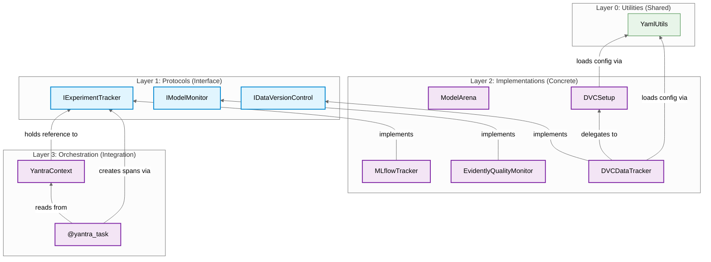
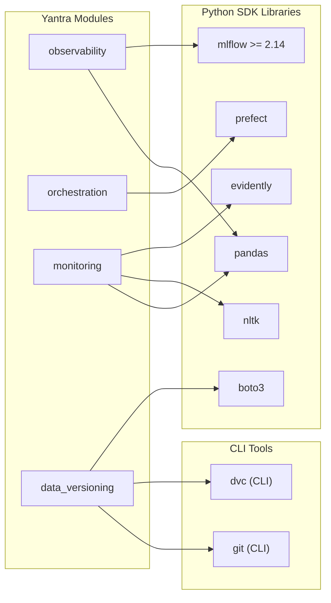

# Cross-Module Analysis — Dependencies

## 1. Module Dependency Graph



---

## 2. Coupling Analysis

### Afferent Coupling (Ca) — Who depends on me?

| S.No | Module | Ca | Dependents |
|:---:|:---|:---:|:---|
| 1 | `observability` | **2** | `orchestration` (context.py, prefect_utils.py) |
| 2 | `utils` | **2** | `data_versioning` (dvc_setup.py, dvc_tracker.py) |
| 3 | `orchestration` | **0** | None (consumer-facing only) |
| 4 | `monitoring` | **0** | None (standalone) |
| 5 | `data_versioning` | **0** | None (standalone) |

### Efferent Coupling (Ce) — Who do I depend on?

| S.No | Module | Ce | Dependencies |
|:---:|:---|:---:|:---|
| 1 | `orchestration` | **1** | `observability` |
| 2 | `data_versioning` | **1** | `utils` |
| 3 | `observability` | **0** | None (leaf module) |
| 4 | `monitoring` | **0** | None (leaf module) |
| 5 | `utils` | **0** | None (foundation) |

### Instability Index: $I = \frac{Ce}{Ca + Ce}$

| S.No | Module | Ca | Ce | Instability ($I$) | Interpretation |
|:---:|:---|:---:|:---:|:---:|:---|
| 1 | `observability` | 2 | 0 | **0.00** | Maximally stable (pure interface provider) |
| 2 | `utils` | 2 | 0 | **0.00** | Maximally stable (foundation layer) |
| 3 | `orchestration` | 0 | 1 | **1.00** | Maximally unstable (consumer-facing) |
| 4 | `data_versioning` | 0 | 1 | **1.00** | Maximally unstable (consumer-facing) |
| 5 | `monitoring` | 0 | 0 | **N/A** | Fully isolated (no coupling) |

### Analysis

The instability indices follow the **Stable Dependencies Principle (SDP)**: unstable modules (`orchestration`, `data_versioning`) depend on stable modules (`observability`, `utils`). Dependencies flow **toward stability**, which is the correct architectural direction.

---

## 3. Architectural Layer Validation

The codebase follows a **3-layer architecture**:

```
Layer 3 - Orchestration (Integration)    : orchestration
Layer 2 - Implementations (Concrete)     : observability.MLflowTracker, monitoring.EvidentlyQualityMonitor, data_versioning.DVCDataTracker
Layer 1 - Protocols (Interface)          : observability.IExperimentTracker, monitoring.IModelMonitor, data_versioning.IDataVersionControl
Layer 0 - Utilities (Shared)             : utils.YamlUtils
```

### Layer Violation Check

| S.No | Dependency | From Layer | To Layer | Valid? | Notes |
|:---:|:---|:---:|:---:|:---:|:---|
| 1 | `orchestration` → `observability.IExperimentTracker` | 3 → 1 | ✅ | Upper layer depends on interface (DIP) |
| 2 | `data_versioning.DVCSetup` → `utils.YamlUtils` | 2 → 0 | ✅ | Implementation depends on utility |
| 3 | `data_versioning.DVCDataTracker` → `utils.YamlUtils` | 2 → 0 | ✅ | Implementation depends on utility |
| 4 | `observability.experiment_tracker_protocol` → `mlflow` | 1 → external | ⚠️ | **Protocol imports implementation library** |

### Violation: Protocol Imports MLflow

**Source:** `experiment_tracker_protocol.py:L4` — `import mlflow`

This is a **layer violation**: the Protocol (interface layer) should not depend on the concrete library (MLflow). While unused at runtime, this import introduces an unnecessary transitive dependency.

**Severity:** Moderate — easy to fix (remove the unused import)

---

## 4. External Dependency Graph



### External Dependency Count

| S.No | Module | Python Libraries | CLI Tools | Total |
|:---:|:---|:---:|:---:|:---:|
| 1 | `observability` | 2 (mlflow, pandas) | 0 | 2 |
| 2 | `orchestration` | 1 (prefect) | 0 | 1 |
| 3 | `monitoring` | 3 (evidently, nltk, pandas) | 0 | 3 |
| 4 | `data_versioning` | 1 (boto3) | 2 (dvc, git) | 3 |
| | **Total Unique** | **6** | **2** | **8** |
