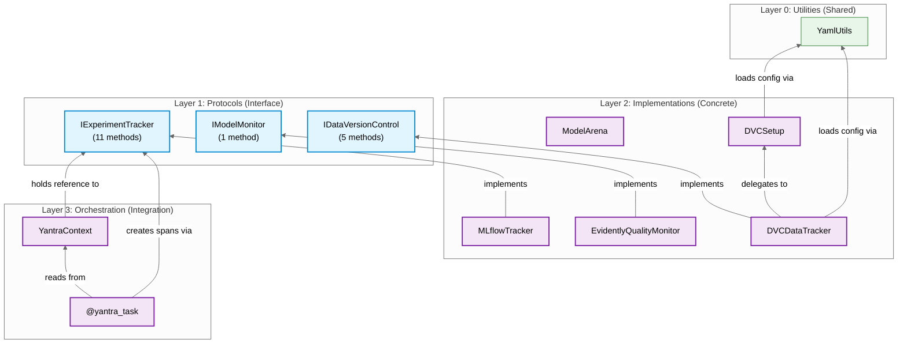
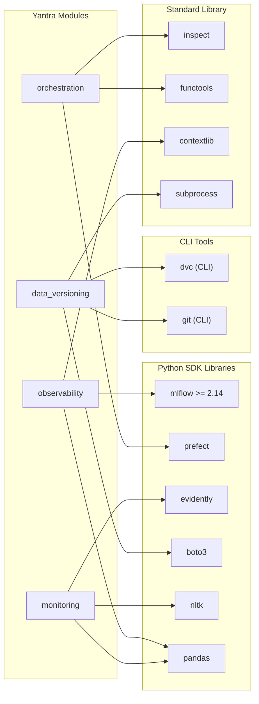

# Cross-Module Analysis — Dependencies

## 1. Module Dependency Graph



---

## 2. Coupling Analysis

### Afferent Coupling (Ca) — Who depends on me?

| S.No | Module | Ca | Dependents |
|:---:|:---|:---:|:---|
| 1 | `observability` | **2** | `orchestration` (context.py, prefect_utils.py) |
| 2 | `utils` | **2** | `data_versioning` (dvc_setup.py, dvc_tracker.py) |
| 3 | `orchestration` | **0** | None (consumer-facing only) |
| 4 | `monitoring` | **0** | None (standalone) |
| 5 | `data_versioning` | **0** | None (standalone) |

### Efferent Coupling (Ce) — Who do I depend on?

| S.No | Module | Ce | Dependencies |
|:---:|:---|:---:|:---|
| 1 | `orchestration` | **1** | `observability` |
| 2 | `data_versioning` | **1** | `utils` |
| 3 | `observability` | **0** | None (leaf module) |
| 4 | `monitoring` | **0** | None (leaf module) |
| 5 | `utils` | **0** | None (foundation) |

### Instability Index: $I = \frac{Ce}{Ca + Ce}$

| S.No | Module | Ca | Ce | Instability ($I$) | Interpretation |
|:---:|:---|:---:|:---:|:---:|:---|
| 1 | `observability` | 2 | 0 | **0.00** | Maximally stable (pure interface provider) |
| 2 | `utils` | 2 | 0 | **0.00** | Maximally stable (foundation layer) |
| 3 | `orchestration` | 0 | 1 | **1.00** | Maximally unstable (consumer-facing) |
| 4 | `data_versioning` | 0 | 1 | **1.00** | Maximally unstable (consumer-facing) |
| 5 | `monitoring` | 0 | 0 | **N/A** | Fully isolated (no coupling) |

### Stable Dependencies Principle (SDP) Validation

The instability indices follow the **Stable Dependencies Principle (SDP)**: unstable modules (`orchestration`, `data_versioning`) depend on stable modules (`observability`, `utils`). Dependencies flow **toward stability**, which is the correct architectural direction.

$$
I(\text{orchestration}) = 1.00 > I(\text{observability}) = 0.00 \quad \checkmark \text{ (SDP satisfied)}
$$

$$
I(\text{data\_versioning}) = 1.00 > I(\text{utils}) = 0.00 \quad \checkmark \text{ (SDP satisfied)}
$$

### Abstractness Index: $A = \frac{\text{abstract components}}{\text{total components}}$

| S.No | Module | Abstract (Protocols) | Concrete (Classes) | $A$ |
|:---:|:---|:---:|:---:|:---:|
| 1 | `observability` | 1 | 2 | 0.33 |
| 2 | `monitoring` | 1 | 1 | 0.50 |
| 3 | `data_versioning` | 1 | 2 | 0.33 |
| 4 | `orchestration` | 0 | 2 | 0.00 |
| 5 | `utils` | 0 | 1 | 0.00 |

### Distance from Main Sequence: $D = |A + I - 1|$

Robert C. Martin's "Zone of Pain" and "Zone of Uselessness" analysis:

| S.No | Module | $A$ | $I$ | $D$ | Zone |
|:---:|:---|:---:|:---:|:---:|:---|
| 1 | `observability` | 0.33 | 0.00 | **0.67** | Near "Zone of Pain" (stable + concrete) |
| 2 | `monitoring` | 0.50 | N/A | N/A | Isolated — no coupling to measure |
| 3 | `data_versioning` | 0.33 | 1.00 | **0.33** | Acceptable |
| 4 | `orchestration` | 0.00 | 1.00 | **0.00** | On main sequence (ideal) |
| 5 | `utils` | 0.00 | 0.00 | **1.00** | In "Zone of Pain" (stable + concrete) |

**Analysis:** `observability` and `utils` are in or near the "Zone of Pain" — they're maximally stable but not abstract enough. For `observability`, this is mitigated by the Protocol interface. For `utils`, it's expected (utility classes are typically concrete and stable).

---

## 3. Architectural Layer Validation

The codebase follows a **4-layer architecture**:

```
Layer 3 - Orchestration (Integration)    : orchestration
Layer 2 - Implementations (Concrete)     : observability.MLflowTracker, monitoring.EvidentlyQualityMonitor, data_versioning.DVCDataTracker
Layer 1 - Protocols (Interface)          : observability.IExperimentTracker, monitoring.IModelMonitor, data_versioning.IDataVersionControl
Layer 0 - Utilities (Shared)             : utils.YamlUtils
```

### Layer Violation Check

| S.No | Dependency | From Layer | To Layer | Direction | Valid? | Notes |
|:---:|:---|:---:|:---:|:---:|:---:|:---|
| 1 | `orchestration` → `observability.IExperimentTracker` | 3 → 1 | ↓ | ✅ | Upper depends on interface (DIP) |
| 2 | `data_versioning.DVCSetup` → `utils.YamlUtils` | 2 → 0 | ↓ | ✅ | Implementation depends on utility |
| 3 | `data_versioning.DVCDataTracker` → `utils.YamlUtils` | 2 → 0 | ↓ | ✅ | Implementation depends on utility |
| 4 | `experiment_tracker_protocol` → `mlflow` | 1 → external | → | ⚠️ | **Protocol imports implementation** |
| 5 | `model_monitor_protocol` → `pandas` | 1 → external | → | ⚠️ | **Protocol imports data library** |

### Layer Violation Summary

**2 violations detected**, both in the Protocol layer importing external libraries:

1. `IExperimentTracker` imports `mlflow` (OBS-GAP-002) — unused import, easy fix
2. `IModelMonitor` imports `pandas` (MON-GAP-003) — used in method signature, harder fix

Only `IDataVersionControl` is truly clean (no external imports in Protocol).

---

## 4. External Dependency Graph



### External Dependency Count

| S.No | Module | Python Libraries | CLI Tools | Stdlib | Total |
|:---:|:---|:---:|:---:|:---:|:---:|
| 1 | `observability` | 2 (mlflow, pandas) | 0 | 1 (contextlib) | 3 |
| 2 | `orchestration` | 1 (prefect) | 0 | 2 (inspect, functools) | 3 |
| 3 | `monitoring` | 3 (evidently, nltk, pandas) | 0 | 0 | 3 |
| 4 | `data_versioning` | 1 (boto3) | 2 (dvc, git) | 1 (subprocess) | 4 |
| | **Total Unique** | **6** | **2** | **4** | **12** |

### Dependency Risk Assessment

| Dependency | License | Active Maintenance | Breaking Change Risk | Yantra Module |
|:---|:---|:---|:---|:---|
| `mlflow >= 2.14` | Apache 2.0 | ✅ Very active | ⚠️ Frequent API changes | observability |
| `prefect` | Apache 2.0 | ✅ Active | ⚠️ V2→V3 migration | orchestration |
| `evidently` | Apache 2.0 | ✅ Active | ⚠️ Legacy API paths | monitoring |
| `nltk` | Apache 2.0 | ⚠️ Slow updates | ✅ Stable | monitoring |
| `pandas` | BSD 3-Clause | ✅ Very active | ✅ Stable API | observability, monitoring |
| `boto3` | Apache 2.0 | ✅ Very active | ✅ Stable API | data_versioning |
| `dvc` (CLI) | Apache 2.0 | ✅ Active | ⚠️ CLI changes | data_versioning |
| `git` (CLI) | GPL 2.0 | ✅ Very active | ✅ Stable | data_versioning |

---

## 5. Transitive Dependency Analysis

### Transitive Closure

Including indirect dependencies:

```
orchestration → observability → {mlflow, pandas, contextlib}
data_versioning → utils → {pyyaml}
monitoring → {evidently → {nltk, pandas, scipy, sklearn, ...}}
```

### Transitive Dependency Count

| Module | Direct | Transitive (1-hop) | Total Reachable |
|:---|:---:|:---:|:---:|
| orchestration | 1 (observability) | 3 (mlflow, pandas, contextlib) | 4 |
| data_versioning | 1 (utils) | 1 (pyyaml) | 2 |
| observability | 0 | 0 | 0 |
| monitoring | 0 | 0 | 0 |

### Dependency Fan-Out

$$
\text{Fan-out}(M) = |\text{direct deps}(M)| + |\text{external deps}(M)|
$$

| Module | Internal Fan-Out | External Fan-Out | Total |
|:---|:---:|:---:|:---:|
| orchestration | 1 | 1 | 2 |
| data_versioning | 1 | 3 | 4 |
| observability | 0 | 3 | 3 |
| monitoring | 0 | 3 | 3 |

**Maximum Fan-Out: 4** (data_versioning) — within acceptable limits.
