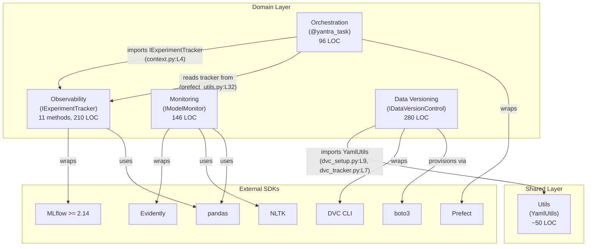
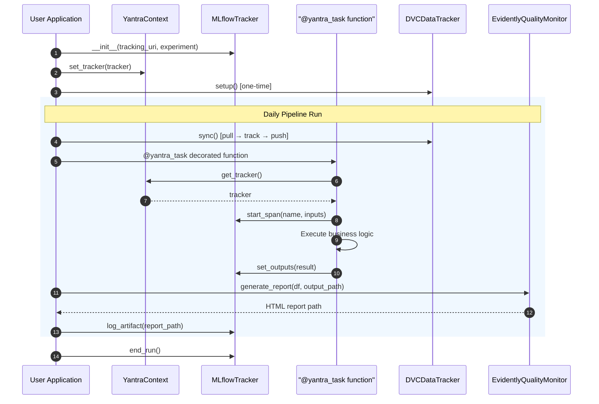
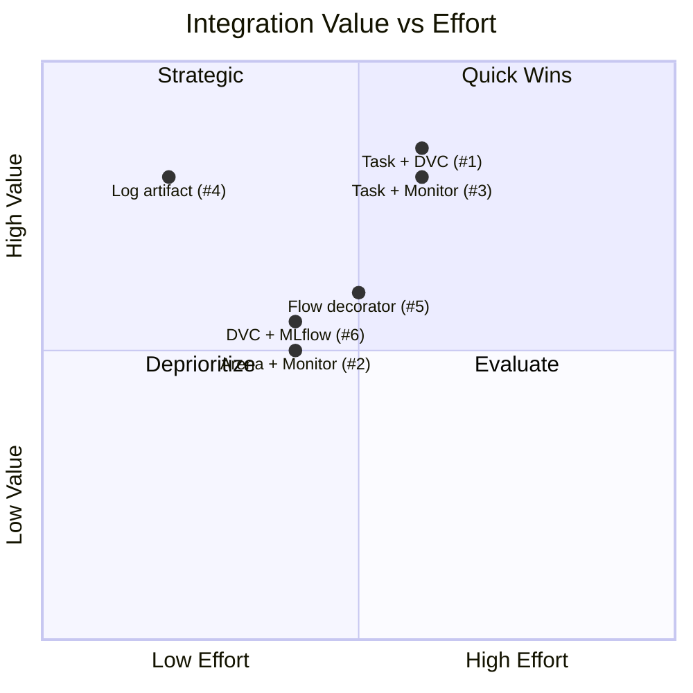

# Cross-Module Analysis — Module Interactions

## 1. System Overview

The Yantra framework consists of 4 domain modules plus a shared utilities layer. The modules interact through **Protocol-based interfaces** rather than direct class references, enabling loose coupling. The system follows a **Protocol-first** design philosophy where each domain module exposes a structural subtyping interface.

### Module Inventory

| S.No | Module | Primary Role | Core Components | Lines | Algorithms | Diagrams | Gaps | Novelty Status |
|:---:|:---|:---|:---|:---:|:---:|:---:|:---:|:---|
| 1 | `observability` | Experiment tracking + LLM tracing | `IExperimentTracker` (11 methods), `MLflowTracker`, `ModelArena` | 210 | 6 | 6 | 10 | INCREMENTAL (Med-High) |
| 2 | `orchestration` | Workflow execution + auto-tracing | `YantraContext`, `@yantra_task` | 96 | 6 | 6 | 10 | INCREMENTAL (Med-High) |
| 3 | `monitoring` | Model quality reporting | `IModelMonitor` (1 method), `EvidentlyQualityMonitor` | 146 | 5 | 6 | 10 | INCREMENTAL (Medium) |
| 4 | `data_versioning` | Data versioning on S3/MinIO | `IDataVersionControl` (5 methods), `DVCSetup`, `DVCDataTracker` | 280 | 6 | 6 | 10 | INCREMENTAL (Medium) |
| 5 | `utils` | Shared utilities (YAML loading) | `YamlUtils` | ~50 | — | — | — | — |
| | **Total** | | | **~782** | **23** | **24** | **40** | |

### Aggregate Scopus Readiness

| Module | Scopus Readiness | Blocking Issue |
|:---|:---:|:---|
| observability | 35% | No tests + Protocol imports `mlflow` |
| orchestration | 30% | No tests + thread-unsafe context |
| monitoring | 30% | No tests + no drift detection |
| data_versioning | 35% | No tests + insecure credentials |
| **System Average** | **32.5%** | **0/4 modules have tests** |

---

## 2. Inter-Module Dependency Map



---

## 3. Dependency Matrix

*Caption: Directed dependency matrix. Cell value indicates the importing module (row) depends on the imported module (column). Verified via `grep -r "from yantra" src/`.*

| | observability | orchestration | monitoring | data_versioning | utils |
|:---|:---:|:---:|:---:|:---:|:---:|
| **observability** | *(self)* | — | — | — | — |
| **orchestration** | ✅ `IExperimentTracker` | *(self)* | — | — | — |
| **monitoring** | — | — | *(self)* | — | — |
| **data_versioning** | — | — | — | *(self)* | ✅ `YamlUtils` |
| **utils** | — | — | — | — | *(self)* |

### Key Observations

1. **Orchestration → Observability** is the **only inter-domain dependency**. The `YantraContext` holds an `IExperimentTracker` reference, and `@yantra_task` creates MLflow spans through it.
2. **Monitoring is fully isolated** — zero internal dependencies. It only depends on external libraries (Evidently, NLTK, pandas).
3. **Data Versioning → Utils** is a cross-layer dependency to the shared utilities (YAML loading).
4. **No circular dependencies** exist anywhere in the graph.
5. **Dependency density** $= \frac{2}{4 \times 3} = 16.7\%$ (2 edges out of 12 possible directed edges among 4 modules) — indicates very low coupling.

---

## 4. Communication Patterns

### Pattern A: Protocol Injection (Orchestration → Observability)

```
Application → YantraContext.set_tracker(MLflowTracker(...))
              ↓
@yantra_task → YantraContext.get_tracker() → IExperimentTracker.start_span()
              ↓
MLflowTracker → mlflow.start_span()
```

**Source:** `context.py:L15` → `prefect_utils.py:L32` → `prefect_utils.py:L49`

**Formal Model:**

$$
\text{Application} \xrightarrow{\text{set\_tracker}(\tau)} \mathcal{C} \xrightarrow{\text{get\_tracker}()} \tau \xrightarrow{\text{start\_span}()} \sigma
$$

This is the **critical integration path** in the entire system. It bridges workflow orchestration (Prefect) with experiment tracking (MLflow) through a singleton context pattern.

**Data Flow Through Bridge:**

| Step | From | To | Data | Type |
|:---|:---|:---|:---|:---|
| 1 | Application | `YantraContext` | `MLflowTracker` instance | `IExperimentTracker` |
| 2 | `@yantra_task` | `YantraContext` | Tracker reference | `Optional[IExperimentTracker]` |
| 3 | `@yantra_task` | `inspect.signature` | Function arguments | `BoundArguments` |
| 4 | `@yantra_task` | `MLflowTracker` | Span (name, inputs) | `Span` |
| 5 | `@yantra_task` | `MLflowTracker` | Result / error | `Dict[str, Any]` |

### Pattern B: Standalone Operation (Monitoring, Data Versioning)

Both `monitoring` and `data_versioning` operate **independently** — they have no inter-domain dependencies. Their integration with the rest of the system is expected to happen at the **application layer** (outside Yantra), not within the library itself.

**Isolation Properties:**

| Module | Internal Deps | External Deps | Can Operate Independently | Import Yantra Only |
|:---|:---|:---|:---|:---|
| monitoring | 0 | 3 (evidently, nltk, pandas) | ✅ | `from yantra.domain.monitoring import IModelMonitor` |
| data_versioning | 1 (utils) | 3 (boto3, dvc, git) | ✅ (with utils) | `from yantra.domain.data_versioning import IDataVersionControl` |

### Pattern C: Shared Utility Access (Data Versioning → Utils)

```
DVCSetup.__init__() → YamlUtils.yaml_safe_load(config_path)
DVCDataTracker.__init__() → YamlUtils.yaml_safe_load(config_path)
```

**Source:** `dvc_setup.py:L24`, `dvc_tracker.py:L21`

This is a **cross-layer** access pattern where domain modules reach into the shared utility layer for configuration loading. Both `DVCSetup` and `DVCDataTracker` independently load the same configuration file, creating a minor duplication concern (DV-GAP-003).

---

## 5. Interaction Sequence Diagrams

### Sequence: Full Pipeline With All Modules

*Caption: Shows the ideal integration flow in a user application that combines all 4 modules in a single MLOps pipeline.*



---

## 6. Potential Integration Points (Not Yet Implemented)

| S.No | Integration | From → To | Description | Value | Effort |
|:---:|:---|:---|:---|:---|:---|
| 1 | `@yantra_task` + `DVCDataTracker` | Orchestration → Data Versioning | Auto-version data artifacts in tracked tasks | High | 2 days |
| 2 | `ModelArena` + `EvidentlyQualityMonitor` | Observability → Monitoring | Run quality checks on Arena evaluation results | Medium | 1 day |
| 3 | `@yantra_task` + `EvidentlyQualityMonitor` | Orchestration → Monitoring | Auto-monitor outputs of traced tasks | High | 2 days |
| 4 | `MLflowTracker.log_artifact` + Quality Reports | Observability → Monitoring | Log Evidently HTML reports as MLflow artifacts | High | 0.5 days |
| 5 | `@yantra_flow` + `YantraContext` | Orchestration (new) | Flow-level decorator that auto-initializes context | Medium | 1-2 days |
| 6 | `DVCDataTracker.sync` + `MLflowTracker.log_dataset` | Data Versioning → Observability | Log versioned datasets to MLflow | Medium | 1 day |

### Integration Value Matrix



---

## 7. System Cohesion Analysis

### Cohesion Metrics

| Metric | Value | Interpretation |
|:---|:---|:---|
| **Dependency density** | 16.7% (2/12 possible edges) | Very low coupling — good |
| **Inter-domain deps** | 1 (orchestration → observability) | Minimal — excellent |
| **Isolated modules** | 2 (monitoring, data_versioning) | 50% fully independent |
| **Shared patterns** | 2 system-wide (Protocol, Defensive) | Consistent architecture |
| **Protocol adoption** | 100% (3/3 domain modules) | Uniform interface pattern |

### Architectural Assessment

The Yantra system achieves a rare balance:
- **High cohesion** within each module (each module has a single responsibility)
- **Low coupling** between modules (only 2 dependencies in the entire system)
- **Consistent patterns** across all modules (Protocol-based abstraction)

This places Yantra in the **"loosely coupled, highly cohesive"** quadrant — the ideal position for a library designed for composable, independent usage.
