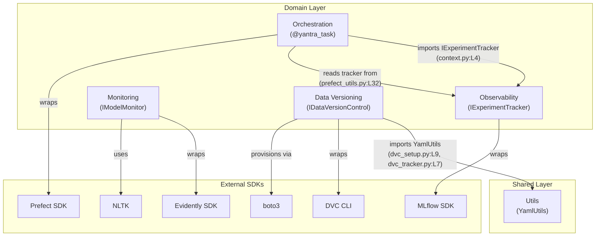

# Cross-Module Analysis — Module Interactions

## 1. Data Flow Overview

The Yantra framework consists of 4 domain modules plus a shared utilities layer. The modules interact through **Protocol-based interfaces** rather than direct class references, enabling loose coupling.

### Module Inventory

| S.No | Module | Primary Role | Core Components | Lines of Code |
|:---:|:---|:---|:---|:---:|
| 1 | `observability` | Experiment tracking + LLM tracing | `IExperimentTracker`, `MLflowTracker`, `ModelArena` | 210 |
| 2 | `orchestration` | Workflow execution + auto-tracing | `YantraContext`, `@yantra_task` | 96 |
| 3 | `monitoring` | Model quality reporting | `IModelMonitor`, `EvidentlyQualityMonitor` | 146 |
| 4 | `data_versioning` | Data versioning on S3/MinIO | `IDataVersionControl`, `DVCSetup`, `DVCDataTracker` | 280 |
| 5 | `utils` | Shared utilities (YAML loading) | `YamlUtils` | ~50 |
| | **Total** | | | **~782** |

---

## 2. Inter-Module Dependency Map



---

## 3. Dependency Matrix

*Caption: Directed dependency matrix. Cell value indicates the importing module (row) depends on the imported module (column). Verified via `grep -r "from yantra" src/`.*

| | observability | orchestration | monitoring | data_versioning | utils |
|:---|:---:|:---:|:---:|:---:|:---:|
| **observability** | *(self)* | — | — | — | — |
| **orchestration** | ✅ `IExperimentTracker` | *(self)* | — | — | — |
| **monitoring** | — | — | *(self)* | — | — |
| **data_versioning** | — | — | — | *(self)* | ✅ `YamlUtils` |
| **utils** | — | — | — | — | *(self)* |

### Key Observations

1. **Orchestration → Observability** is the **only inter-domain dependency**. The `YantraContext` holds an `IExperimentTracker` reference, and `@yantra_task` creates MLflow spans through it.
2. **Monitoring is fully isolated** — zero internal dependencies. It only depends on external libraries (Evidently, NLTK, pandas).
3. **Data Versioning → Utils** is a cross-layer dependency to the shared utilities (YAML loading).
4. **No circular dependencies** exist anywhere in the graph.

---

## 4. Communication Patterns

### Pattern A: Protocol Injection (Orchestration → Observability)

```
Application → YantraContext.set_tracker(MLflowTracker(...))
              ↓
@yantra_task → YantraContext.get_tracker() → IExperimentTracker.start_span()
              ↓
MLflowTracker → mlflow.start_span()
```

**Source:** `context.py:L15` → `prefect_utils.py:L32` → `prefect_utils.py:L49`

This is the **critical integration path** in the entire system. It bridges workflow orchestration (Prefect) with experiment tracking (MLflow) through a singleton context pattern.

### Pattern B: Standalone Operation (Monitoring, Data Versioning)

Both `monitoring` and `data_versioning` operate **independently** — they have no inter-domain dependencies. Their integration with the rest of the system is expected to happen at the **application layer** (outside Yantra), not within the library itself.

### Pattern C: Shared Utility Access (Data Versioning → Utils)

```
DVCSetup.__init__() → YamlUtils.yaml_safe_load(config_path)
DVCDataTracker.__init__() → YamlUtils.yaml_safe_load(config_path)
```

**Source:** `dvc_setup.py:L24`, `dvc_tracker.py:L21`

This is a **cross-layer** access pattern where domain modules reach into the shared utility layer for configuration loading.

---

## 5. Potential Integration Points (Not Yet Implemented)

| S.No | Integration | From → To | Description | Effort |
|:---:|:---|:---|:---|:---|
| 1 | `@yantra_task` + `DVCDataTracker` | Orchestration → Data Versioning | Auto-version data artifacts in tracked tasks | 2 days |
| 2 | `ModelArena` + `EvidentlyQualityMonitor` | Observability → Monitoring | Run quality checks on Arena evaluation results | 1 day |
| 3 | `@yantra_task` + `EvidentlyQualityMonitor` | Orchestration → Monitoring | Auto-monitor outputs of traced tasks | 2 days |
| 4 | `MLflowTracker.log_artifact` + Quality Reports | Observability → Monitoring | Log Evidently HTML reports as MLflow artifacts | 0.5 days |
