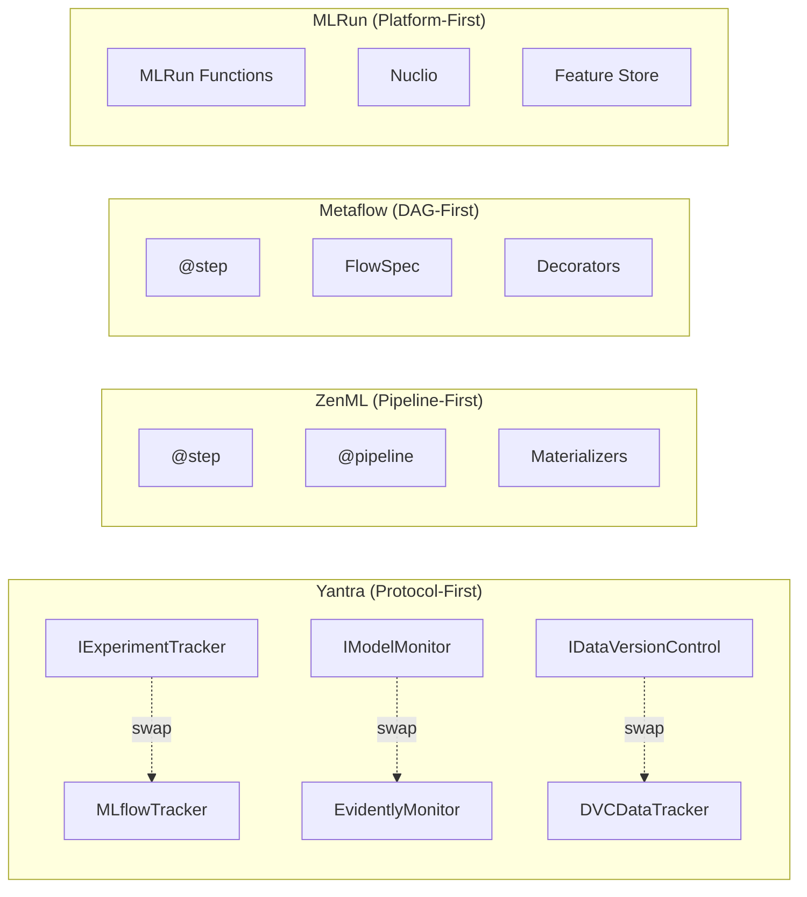

# Cross-Module Analysis — System-Level Novelty

## System-Level Novelty Classification

**Status:** INCREMENTAL

**Confidence:** MEDIUM

---

## 1. System-Level Innovation: Protocol-First MLOps Infrastructure Library

### Claim

Yantra presents a **Protocol-first** approach to building MLOps infrastructure in Python. Rather than providing a monolithic framework, it offers a collection of domain-specific modules — each with a Protocol interface and a concrete implementation — that can be composed, swapped, or used independently. This architectural philosophy is distinct from existing MLOps frameworks that tend toward monolithic or framework-locked designs.

### Evidence

| Module | Protocol | Implementation | External Backend |
|:---|:---|:---|:---|
| Observability | `IExperimentTracker` | `MLflowTracker` | MLflow |
| Monitoring | `IModelMonitor` | `EvidentlyQualityMonitor` | Evidently |
| Data Versioning | `IDataVersionControl` | `DVCDataTracker` | DVC + S3 |
| Orchestration | — (uses IExperimentTracker) | `@yantra_task` | Prefect |

### Architectural Uniqueness

### Related Work Comparison

| Framework | Architecture | Backend Swapping | Protocol-Based | Modular Composition |
|:---|:---|:---:|:---:|:---:|
| **Yantra** | Protocol-first library | ✅ (via Protocol) | ✅ | ✅ (use any subset) |
| ZenML | Pipeline-first framework | ✅ (via Materializers) | ❌ (class inheritance) | ⚠️ (must use pipeline) |
| Metaflow | DAG-first framework | ⚠️ (limited) | ❌ | ⚠️ (must use FlowSpec) |
| MLRun | Platform-first | ⚠️ (plugin-based) | ❌ | ❌ (monolithic) |
| Kedro | Pipeline-first | ✅ (Catalog) | ❌ (class-based) | ⚠️ (pipeline required) |

**Key Differentiator:** Yantra is a **library** (use what you need) rather than a **framework** (use our way or not at all). This is architecturally analogous to the "library vs. framework" distinction that made React succeed over Angular 1.x.

---

## 2. Cross-Module Synergy: Orchestration + Observability Bridge

### Claim

The integration between `orchestration` and `observability` — where `@yantra_task` automatically creates MLflow spans for Prefect tasks — represents a **novel bridging pattern**. No existing framework provides a single decorator that simultaneously creates a Prefect task AND an MLflow trace span.

### Evidence

- `context.py:L4` imports `IExperimentTracker` (only inter-domain dependency)
- `prefect_utils.py:L49` creates spans via the Protocol interface
- `prefect_utils.py:L43-L45` gracefully degrades when no tracker is configured

### Significance

This bridge eliminates the **instrumentation gap** between orchestration (Prefect knows what to run) and observability (MLflow knows what happened). Currently, teams must manually add MLflow calls inside Prefect tasks — Yantra automates this entirely.

---

## 3. Cross-Module Pattern: Consistent 3-Tier Architecture

### Claim

All domain modules follow the same structural pattern: **Protocol → Implementation → Public API**, creating a consistent architectural vocabulary across the entire library.

### Evidence

| Tier | Observability | Monitoring | Data Versioning |
|:---|:---|:---|:---|
| Protocol | `IExperimentTracker` | `IModelMonitor` | `IDataVersionControl` |
| Implementation | `MLflowTracker`, `ModelArena` | `EvidentlyQualityMonitor` | `DVCSetup`, `DVCDataTracker` |
| Public API (`__init__.py`) | Exports both | Exports both | Exports all 4 |

### Significance

This consistency enables:
1. **Predictable learning curve** — understanding one module teaches the pattern for all
2. **Uniform testing strategy** — mock the Protocol, test the implementation
3. **Easy extension** — add a new module by following the established template

---

## 4. Aggregate Novelty Assessment

### Per-Module Novelty (from Phase 1)

| Module | Novelty Status | Confidence | Strongest Contribution |
|:---|:---|:---|:---|
| `observability` | INCREMENTAL | MEDIUM | Protocol-decoupled experiment tracking |
| `orchestration` | INCREMENTAL | MEDIUM | Dual-context decorator (Prefect + MLflow) |
| `monitoring` | INCREMENTAL | LOW | Text-first quality monitoring for GenAI |
| `data_versioning` | INCREMENTAL | MEDIUM | Infrastructure vs. Workflow separation |

### System-Level Novelty Synthesis

**Individual modules = INCREMENTAL.** 
**Combined system = borderline INCREMENTAL-to-NOVEL.**

The individual module contributions are incremental (applying known patterns — Protocol, Singleton, Decorator — to new domains). However, the **systematic application** of Protocol-first architecture across 4 MLOps domains, with a demonstrated integration bridge (orchestration ↔ observability), creates a coherent system-level contribution that is more than the sum of its parts.

---

## 5. Publication Positioning

### Recommended Paper Title Options

1. "Yantra: A Protocol-First Python Library for Composable MLOps Infrastructure"
2. "Protocol-Based Abstraction for Backend-Agnostic MLOps: Design and Analysis of Yantra"
3. "From Monolith to Protocols: Clean Architecture Patterns for ML Infrastructure"

### Recommended Venue Type

| Venue Type | Fit | Rationale |
|:---|:---|:---|
| **Workshop paper** (MLOps @ ICML/NeurIPS) | ⭐⭐⭐ Strong | Practical contribution with architectural novelty |
| **Short paper** (CAIN, SE4ML) | ⭐⭐⭐ Strong | Software engineering for ML focus |
| **Tool/Demo paper** (AAAI, IJCAI) | ⭐⭐ Good | Working system demonstration |
| **Full paper** (top-tier) | ⭐ Weak | Needs empirical validation and benchmarks |

### Strengthening Recommendations

1. **Add benchmarks:** Measure overhead of Protocol abstraction vs. direct SDK calls (strongest impact)
2. **Add alternative implementations:** Create `NullTracker`, `WandbTracker`, `DeepChecksMonitor` (demonstrates swappability)
3. **Add drift detection:** Upgrade monitoring module (elevates from INCREMENTAL to NOVEL)
4. **Add case study:** Deploy Yantra in a real ML pipeline and measure developer productivity
