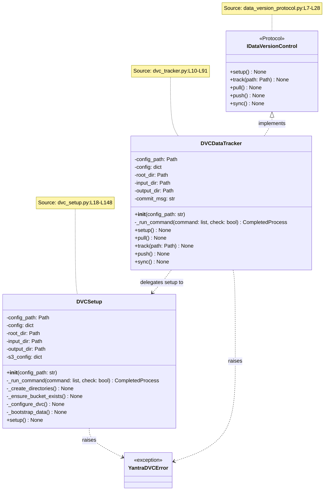
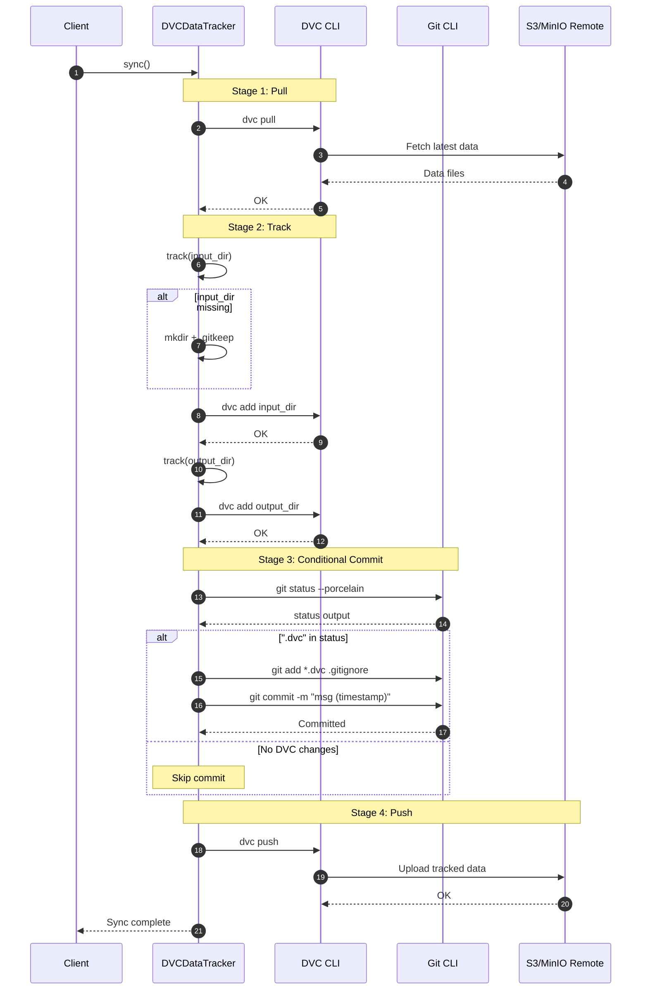
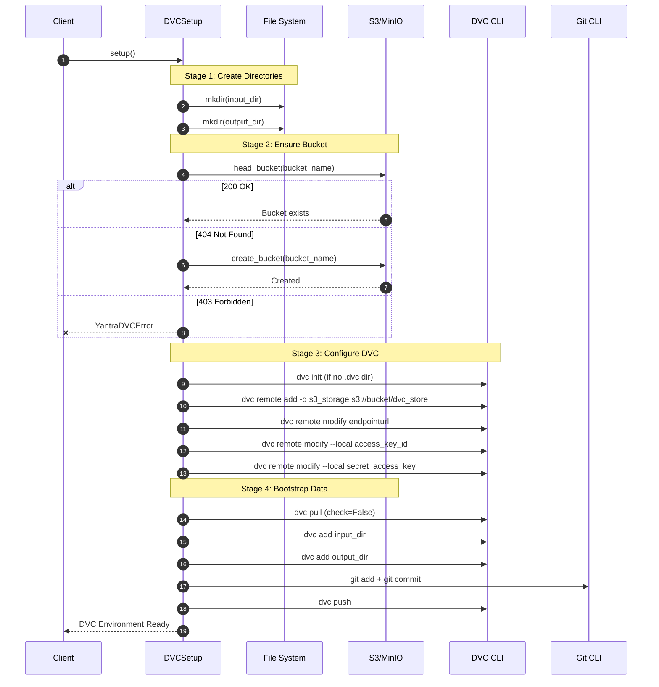
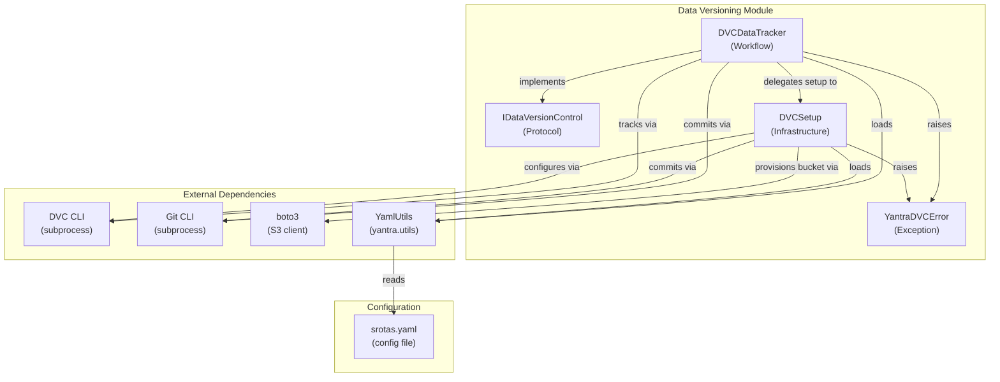

# Data Versioning Module - Architecture

## Figure 1: Class Diagram — Protocol-Based Data Versioning Layer

*Caption: Class hierarchy showing the `IDataVersionControl` protocol (5 methods, `@runtime_checkable`), the `DVCSetup` infrastructure provisioner, and the `DVCDataTracker` workflow executor. Separation of concerns between setup (infrastructure) and tracking (workflow) is clearly delineated. All names verified against source code.*

---

## Figure 2: Sequence Diagram — `sync()` Full Workflow

*Caption: Sequence diagram showing the complete `DVCDataTracker.sync()` workflow: Pull → Track(input) → Track(output) → conditional Git Commit → DVC Push. Verified against `dvc_tracker.py:L72-L91`.*

---

## Figure 3: Sequence Diagram — `DVCSetup.setup()` Infrastructure Bootstrap

*Caption: Sequence diagram showing the 4-stage infrastructure bootstrap: directory creation, S3 bucket provisioning (with idempotent create), DVC remote configuration, and initial data bootstrapping. Verified against `dvc_setup.py:L133-L148`.*

---

## Figure 4: Component Diagram — Module Dependencies

*Caption: Component-level view showing internal structure and external dependencies. The module bridges DVC CLI, Git CLI, boto3, and YAML configuration. Verified via `import` statements.*

---

## Table 1: Protocol Method Coverage

*Caption: Complete enumeration of `IDataVersionControl` protocol methods and their implementation in `DVCDataTracker`. Source: `data_version_protocol.py:L7-L28`, `dvc_tracker.py:L10-L91`.*

| S.No | Method | Protocol (L#) | Implementation (L#) | Underlying Commands |
|:---:|:---|:---|:---|:---|
| 1 | `setup()` | L10 | L38-L45 | Delegates to `DVCSetup.setup()` |
| 2 | `track(path)` | L14 | L55-L66 | `mkdir`, `touch .gitkeep`, `dvc add` |
| 3 | `pull()` | L18 | L47-L53 | `dvc pull` (with `.dvc` existence check) |
| 4 | `push()` | L22 | L68-L70 | `dvc push` |
| 5 | `sync()` | L26 | L72-L91 | `pull` → `track` × 2 → `git commit` → `push` |

---

## Table 2: DVC CLI Commands Used

*Caption: All DVC and Git CLI commands invoked via `subprocess.run()`, their purpose, and source location.*

| S.No | Command | Purpose | Source | Error Handling |
|:---:|:---|:---|:---|:---|
| 1 | `dvc init` | Initialize DVC repo | `dvc_setup.py:L91` | Conditional (if `.dvc` missing) |
| 2 | `dvc remote add -d` | Set default remote | `dvc_setup.py:L98` | `--force` flag |
| 3 | `dvc remote modify` | Configure remote settings | `dvc_setup.py:L103-L111` | `check=True` |
| 4 | `dvc pull` | Download from remote | `dvc_tracker.py:L53` | `check=False` (tolerant) |
| 5 | `dvc add` | Track files/directories | `dvc_tracker.py:L66` | `check=True` |
| 6 | `dvc push` | Upload to remote | `dvc_tracker.py:L70` | `check=True` |
| 7 | `git status --porcelain` | Check for changes | `dvc_tracker.py:L83` | `check=True` |
| 8 | `git add` | Stage DVC metadata | `dvc_tracker.py:L86` | `check=True` |
| 9 | `git commit` | Commit with timestamp | `dvc_tracker.py:L89` | `check=True` |
