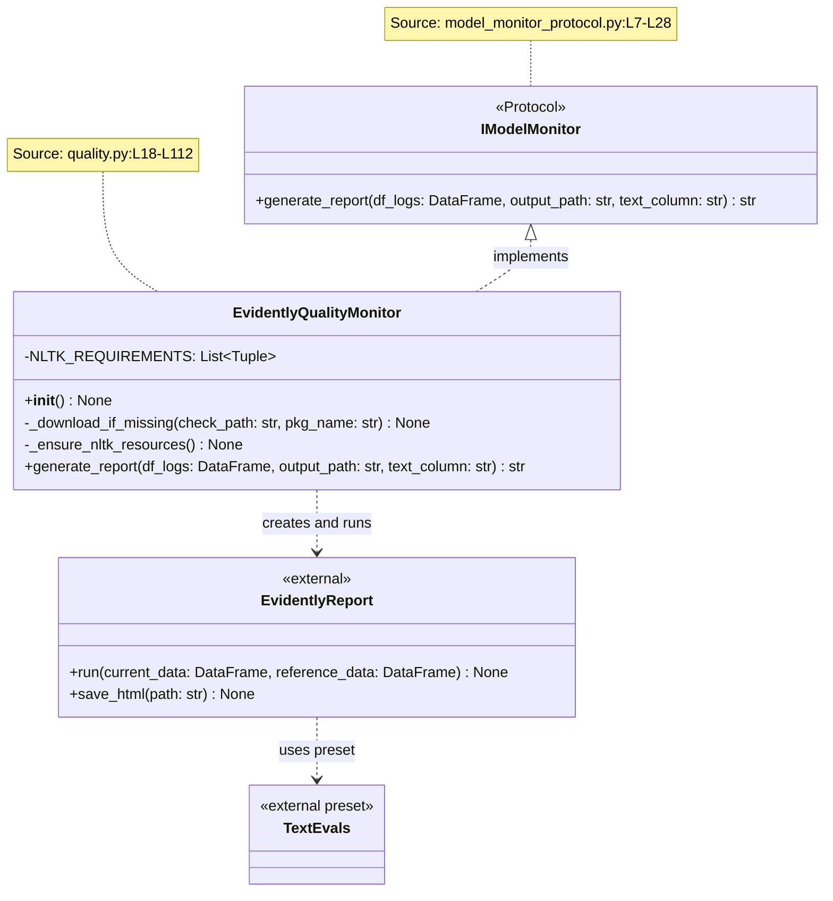
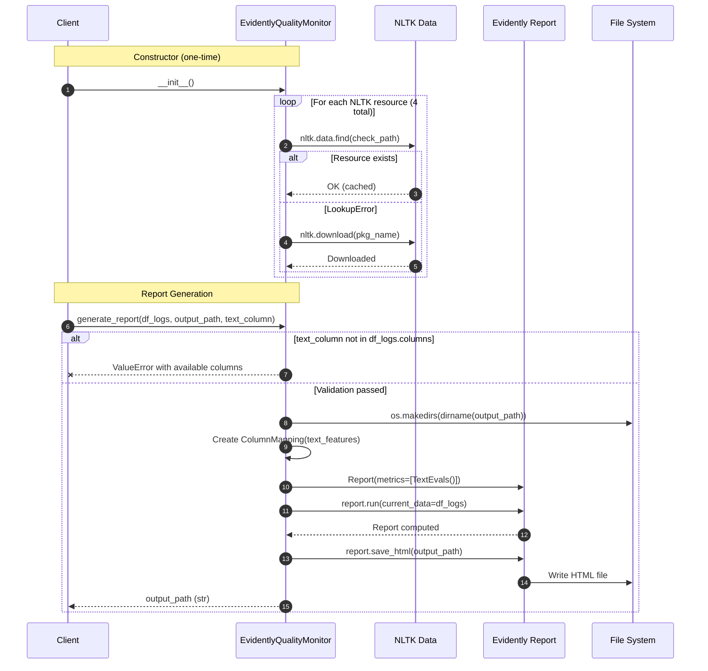
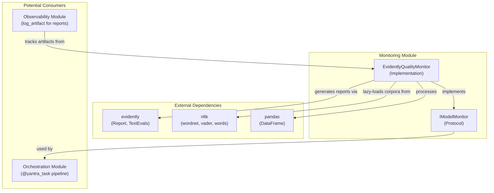

# Monitoring Module - Architecture

## Figure 1: Class Diagram — Protocol-Based Monitoring Layer

*Caption: Class diagram showing the `IModelMonitor` protocol (runtime-checkable) and its concrete implementation `EvidentlyQualityMonitor`. The protocol enables swapping between Evidently, DeepChecks, or Whylogs without client code changes. All class and method names verified against source code.*

---

## Figure 2: Sequence Diagram — `generate_report` Execution Flow

*Caption: Sequence diagram showing the complete lifecycle of `EvidentlyQualityMonitor.generate_report()`. Demonstrates input validation, NLTK resource check (at init), Evidently report execution, and HTML serialization. Verified against `quality.py:L33-L112`.*

---

## Figure 3: Component Diagram — Module Dependencies

*Caption: Component-level view showing the Monitoring module's external dependencies (Evidently, NLTK, pandas) and its relationship to the broader Yantra system. Verified via `import` statements in source files.*

---

## Table 1: NLTK Resource Requirements

*Caption: NLTK corpora and lexicons required by `EvidentlyQualityMonitor`, their check paths, and purpose. Source: `quality.py:L26-L31`.*

| S.No | Check Path | Package Name | Purpose |
|:---:|:---|:---|:---|
| 1 | `corpora/wordnet` | `wordnet` | Word sense disambiguation, synonym detection |
| 2 | `corpora/omw-1.4` | `omw-1.4` | Open Multilingual Wordnet for cross-language support |
| 3 | `sentiment/vader_lexicon.zip` | `vader_lexicon` | VADER sentiment analysis lexicon |
| 4 | `corpora/words` | `words` | English word list for OOV (Out-of-Vocabulary) detection |

---

## Table 2: Protocol Method Specification

*Caption: Complete specification of the `IModelMonitor` protocol. Note the `@runtime_checkable` decorator enabling `isinstance()` checks. Source: `model_monitor_protocol.py:L6-L28`.*

| S.No | Method | Parameters | Return | Purpose |
|:---:|:---|:---|:---|:---|
| 1 | `generate_report` | `df_logs: DataFrame`, `output_path: str`, `text_column: str = "response"` | `str` (path) | Generate quality report from LLM log data |
