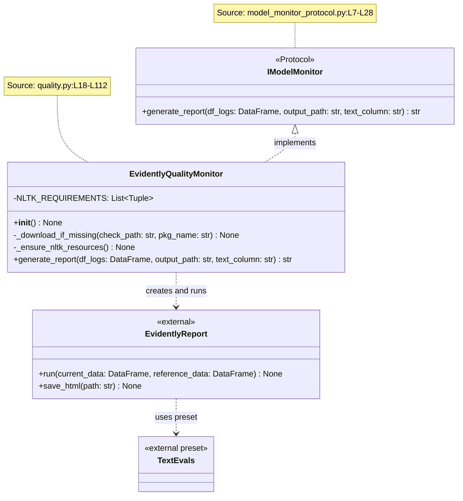
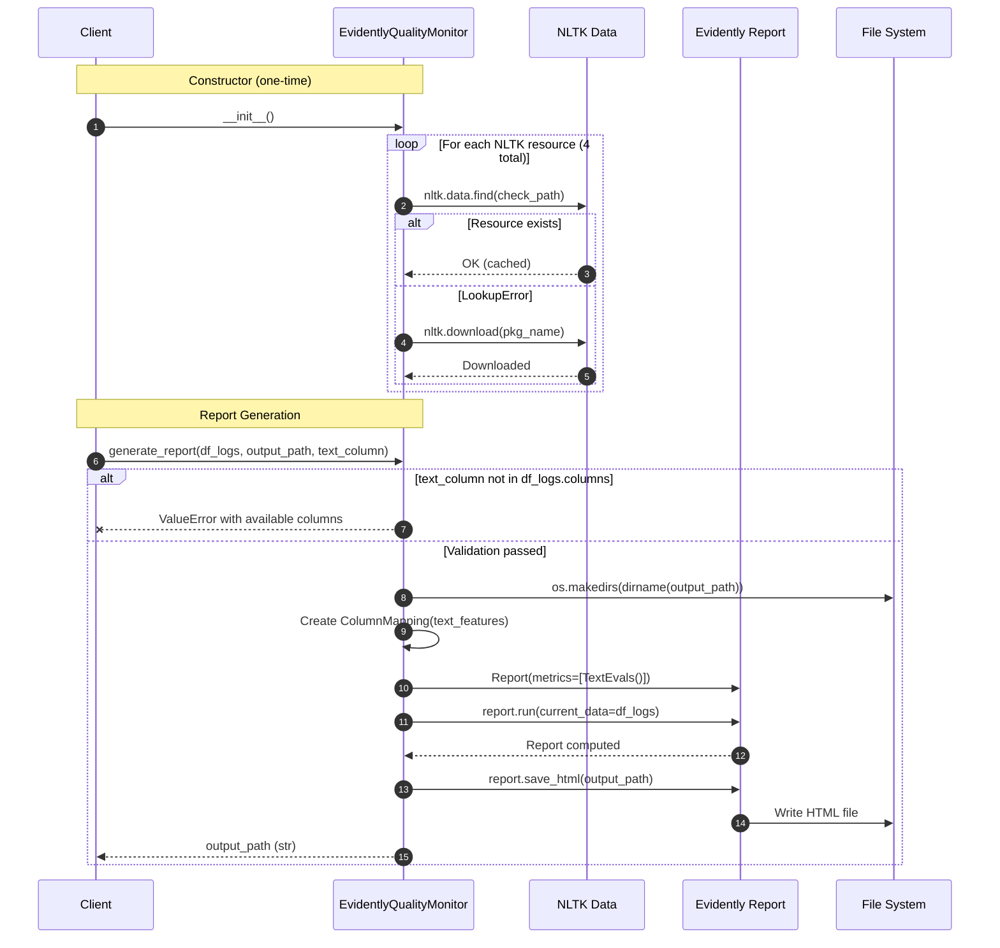
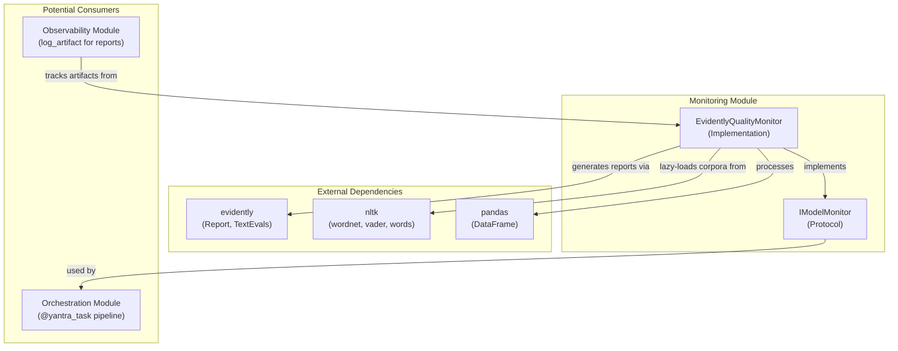
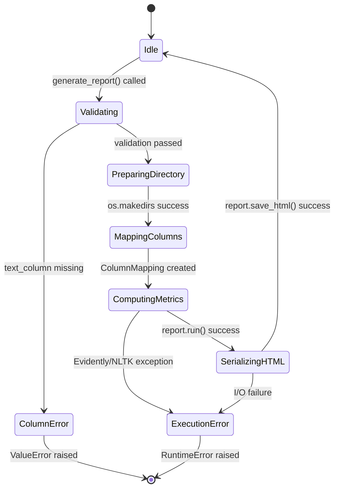
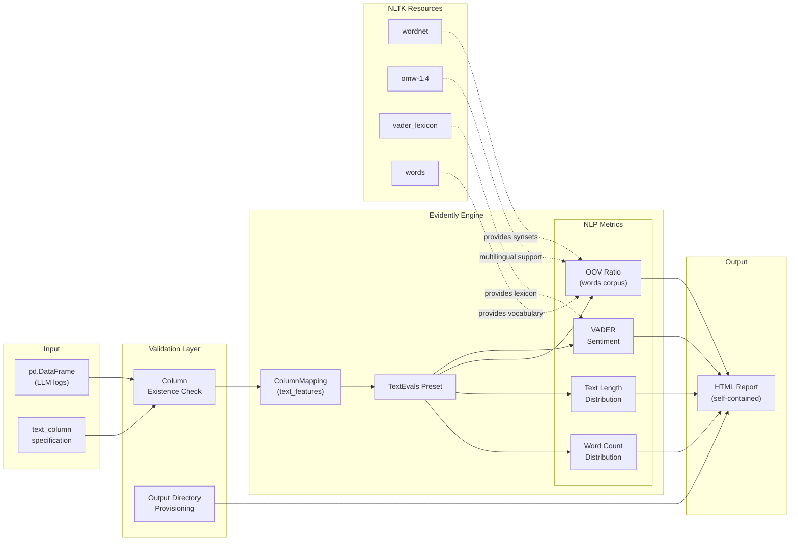
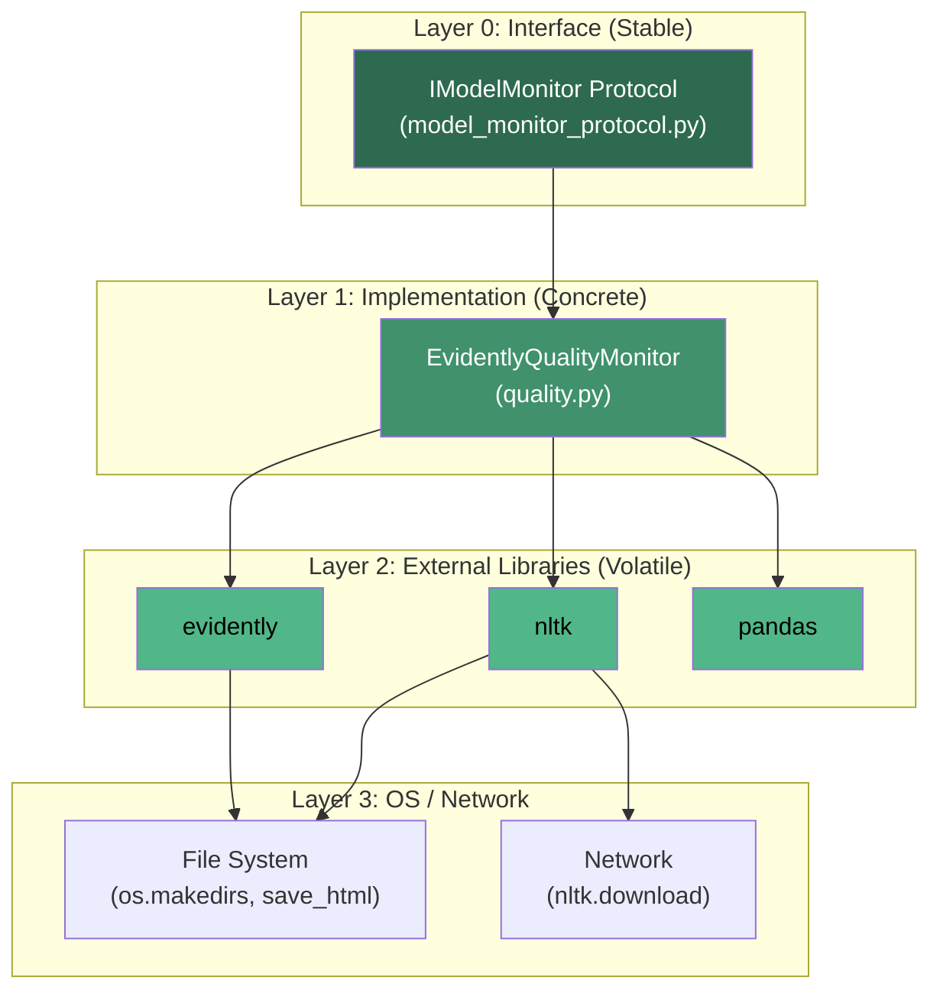

# Monitoring Module - Architecture

## Figure 1: Class Diagram — Protocol-Based Monitoring Layer

*Caption: Class diagram showing the `IModelMonitor` protocol (runtime-checkable) and its concrete implementation `EvidentlyQualityMonitor`. The protocol enables swapping between Evidently, DeepChecks, or Whylogs without client code changes. All class and method names verified against source code.*

---

## Figure 2: Sequence Diagram — `generate_report` Execution Flow

*Caption: Sequence diagram showing the complete lifecycle of `EvidentlyQualityMonitor.generate_report()`. Demonstrates input validation, NLTK resource check (at init), Evidently report execution, and HTML serialization. Verified against `quality.py:L33-L112`.*

---

## Figure 3: Component Diagram — Module Dependencies

*Caption: Component-level view showing the Monitoring module's external dependencies (Evidently, NLTK, pandas) and its relationship to the broader Yantra system. Verified via `import` statements in source files.*

---

## Figure 4: State Diagram — Report Generation Lifecycle

*Caption: State machine showing the lifecycle of a `generate_report()` invocation, including validation, computation, serialization, and error states. Each state corresponds to a distinct operation phase.*

---

## Figure 5: Data Flow Diagram — NLP Processing Pipeline

*Caption: Shows how data flows from raw LLM log DataFrames through NLTK tokenization, VADER sentiment analysis, and Evidently metric aggregation to produce the final HTML report.*

---

## Figure 6: Layered Architecture — Clean Architecture Alignment

*Caption: Shows how the monitoring module adheres to Clean Architecture principles with distinct interface, implementation, and external dependency layers.*

---

## Table 1: NLTK Resource Requirements

*Caption: NLTK corpora and lexicons required by `EvidentlyQualityMonitor`, their check paths, purpose, and approximate download size. Source: `quality.py:L26-L31`.*

| S.No | Check Path | Package Name | Purpose | Approx. Size |
|:---:|:---|:---|:---|:---|
| 1 | `corpora/wordnet` | `wordnet` | Word sense disambiguation, synonym detection | ~12 MB |
| 2 | `corpora/omw-1.4` | `omw-1.4` | Open Multilingual Wordnet for cross-language support | ~5 MB |
| 3 | `sentiment/vader_lexicon.zip` | `vader_lexicon` | VADER sentiment analysis lexicon (7,517 entries) | ~500 KB |
| 4 | `corpora/words` | `words` | English word list for OOV detection (236,736 words) | ~700 KB |

**Total cold-start download:** ~18 MB

---

## Table 2: Protocol Method Specification

*Caption: Complete specification of the `IModelMonitor` protocol. Note the `@runtime_checkable` decorator enabling `isinstance()` checks. Source: `model_monitor_protocol.py:L6-L28`.*

| S.No | Method | Parameters | Return | Purpose |
|:---:|:---|:---|:---|:---|
| 1 | `generate_report` | `df_logs: DataFrame`, `output_path: str`, `text_column: str = "response"` | `str` (path) | Generate quality report from LLM log data |

---

## Table 3: Error Handling Strategy

*Caption: Comprehensive error handling matrix showing error conditions, their detection mechanism, and recovery behavior. Verified against `quality.py:L79-L111`.*

| S.No | Error Condition | Detection | Exception Type | Recovery | Source |
|:---:|:---|:---|:---|:---|:---|
| 1 | Missing text column | `text_column not in df_logs.columns` | `ValueError` | Fail-fast with column list | `quality.py:L80-L84` |
| 2 | NLTK resource missing | `LookupError` from `nltk.data.find()` | Auto-download | Lazy acquisition | `quality.py:L41-L45` |
| 3 | Evidently computation failure | Generic `Exception` catch | `RuntimeError` (chained) | Error logged with `exc_info=True` | `quality.py:L109-L111` |
| 4 | Output directory missing | `os.makedirs(..., exist_ok=True)` | Auto-create | Idempotent provisioning | `quality.py:L87` |

---

## Table 4: TextEvals Metrics Inventory

*Caption: Complete list of NLP metrics computed by the Evidently TextEvals preset, their mathematical basis, and interpretation guidance.*

| S.No | Metric | Algorithm | Range | Good Value | Interpretation |
|:---:|:---|:---|:---|:---|:---|
| 1 | Sentiment (compound) | VADER lexicon + rules | [-1, +1] | Domain-dependent | >0.05 positive, <-0.05 negative |
| 2 | Text Length | Character count | [0, ∞) | Domain-dependent | Consistency indicator |
| 3 | OOV Ratio | Token-vs-vocabulary | [0, 1] | <0.10 | High = garbled/hallucinated output |
| 4 | Word Count | Whitespace tokenization | [0, ∞) | Domain-dependent | Response completeness |

---

## Table 5: Architectural Design Decisions

*Caption: Key architectural decisions and their rationale, tracing design intent to implementation.*

| S.No | Decision | Rationale | Alternative Considered | Trade-off |
|:---:|:---|:---|:---|:---|
| 1 | Single-method Protocol | Minimal interface; easy to implement | Multi-method interface | Simplicity vs. interface depth (see MON-GAP) |
| 2 | `@runtime_checkable` | Enables DI validation via `isinstance()` | Omit decorator | Minor runtime cost; significant DI benefit |
| 3 | Eager NLTK in constructor | Resources ready before any report call | Lazy in `generate_report` | Slower init, faster first report |
| 4 | Evidently TextEvals preset | Pre-configured, production-tested metrics | Custom VADER pipeline | Less control; more reliability |
| 5 | HTML output format | Rich visualizations, self-contained | JSON/dict | Human-readable vs. machine-readable |
| 6 | `pandas` in Protocol signature | Ubiquitous in ML; practical choice | `Any` type | Coupling vs. type safety (see MON-GAP-003) |
| 7 | Exception chaining (`from exc`) | Preserves original traceback | Re-raise original | Better debugging; standardized error type |
| 8 | Structured logging (`logger`) | Production-grade; unlike `print()` in other modules | `print()` | Best practice; enables log aggregation |
