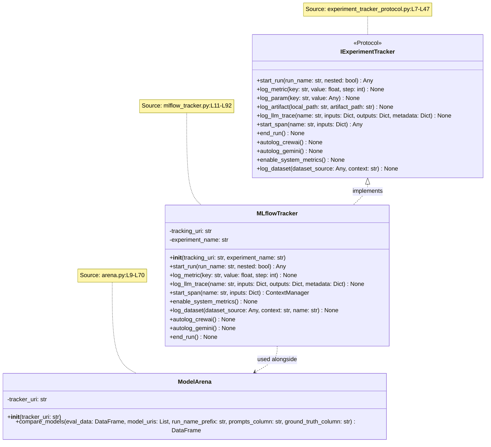
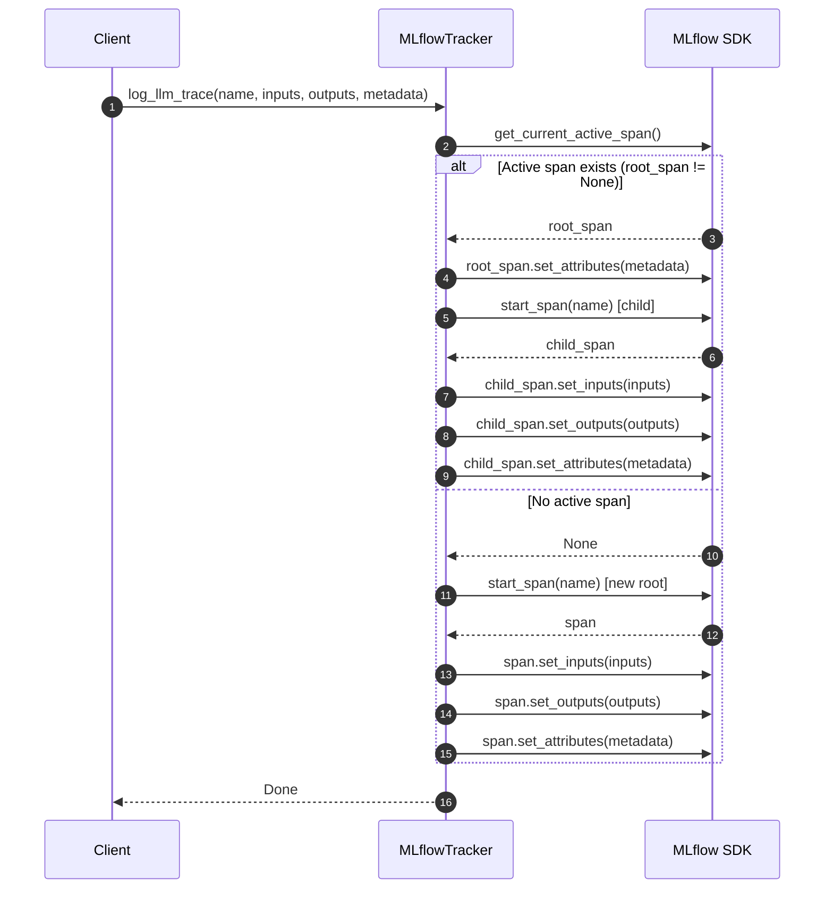
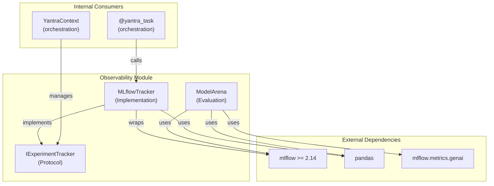

# Observability Module - Architecture

## Figure 1: Class Diagram — Protocol-Based Observability Layer

*Caption: Class hierarchy of the Observability module showing the `IExperimentTracker` protocol, its concrete implementation `MLflowTracker`, and the `ModelArena` evaluation component. All class and method names verified against source code.*

---

## Figure 2: Sequence Diagram — `log_llm_trace` Adaptive Span Logic

*Caption: Sequence diagram showing the conditional branching in `MLflowTracker.log_llm_trace()`. When a parent span exists, a child span is created; otherwise, a new root trace is started. Verified against `mlflow_tracker.py:L54-L79`.*

---

## Figure 3: Component Diagram — Module Dependencies

*Caption: Component-level view showing the Observability module's external and internal dependencies. Verified via `import` statements in source files.*

---

## Table 1: Protocol Method Coverage

*Caption: Complete enumeration of `IExperimentTracker` protocol methods and their `MLflowTracker` implementation status. Source: `experiment_tracker_protocol.py:L7-L47`, `mlflow_tracker.py:L11-L92`.*

| S.No | Method | Protocol (L#) | Implementation (L#) | MLflow SDK Call |
|:---:|:---|:---|:---|:---|
| 1 | `start_run` | L10 | L42 | `mlflow.start_run()` |
| 2 | `log_metric` | L12 | L45 | `mlflow.log_metric()` |
| 3 | `log_param` | L14 | L48 | `mlflow.log_param()` |
| 4 | `log_artifact` | L16 | L51 | `mlflow.log_artifact()` |
| 5 | `log_llm_trace` | L18-L24 | L54-L79 | `mlflow.start_span()` |
| 6 | `start_span` | L26-L28 | L81-L89 | `mlflow.start_span()` |
| 7 | `end_run` | L30 | L91 | `mlflow.end_run()` |
| 8 | `autolog_crewai` | L32 | L36 | `mlflow.crewai.autolog()` |
| 9 | `autolog_gemini` | L34 | L39 | `mlflow.gemini.autolog()` |
| 10 | `enable_system_metrics` | L36-L38 | L16-L18 | `mlflow.enable_system_metrics_logging()` |
| 11 | `log_dataset` | L40-L46 | L20-L34 | `mlflow.data.from_pandas()` |
