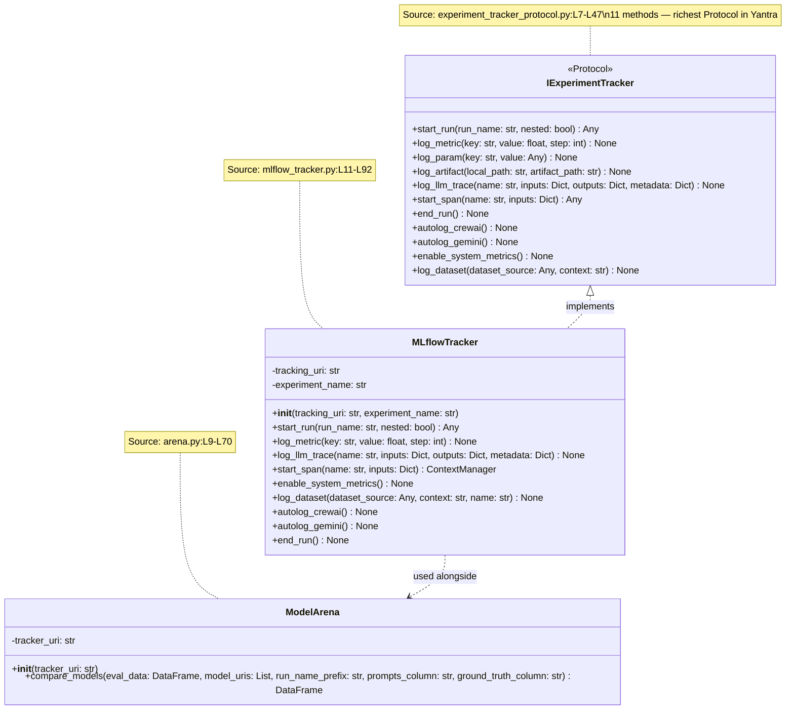
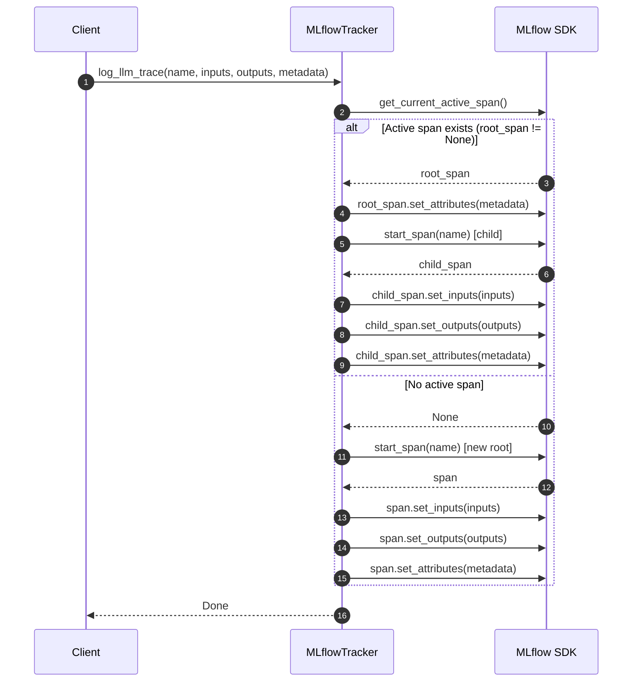
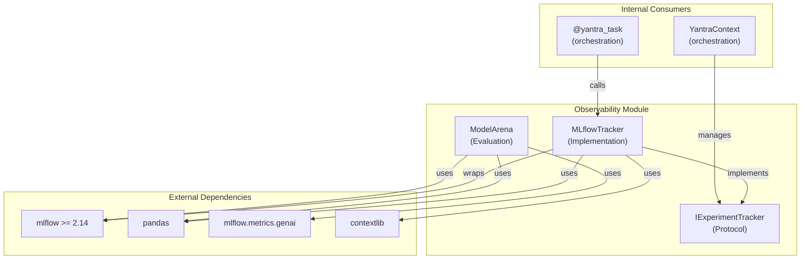
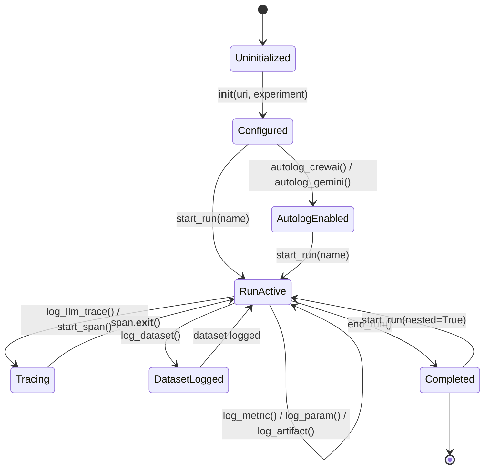
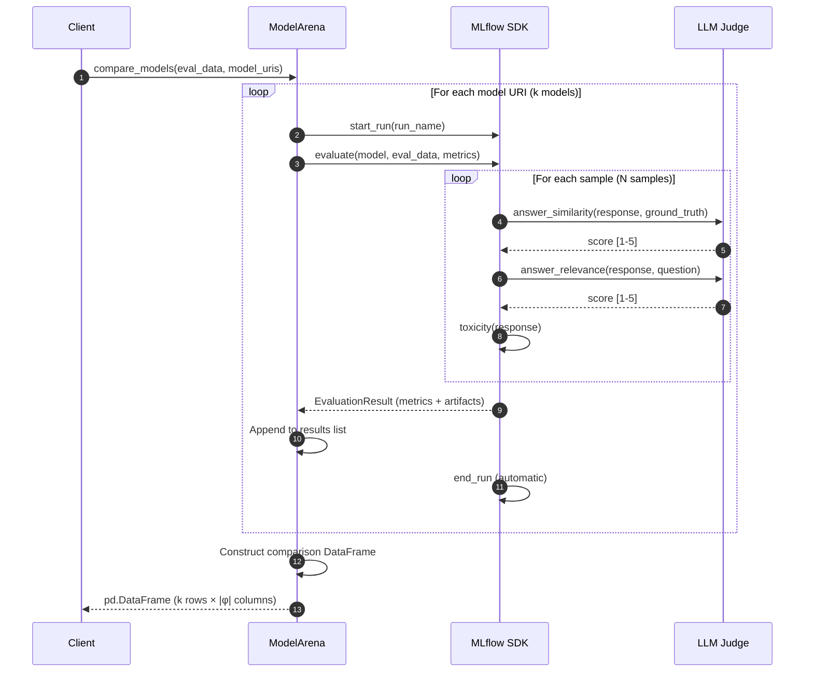
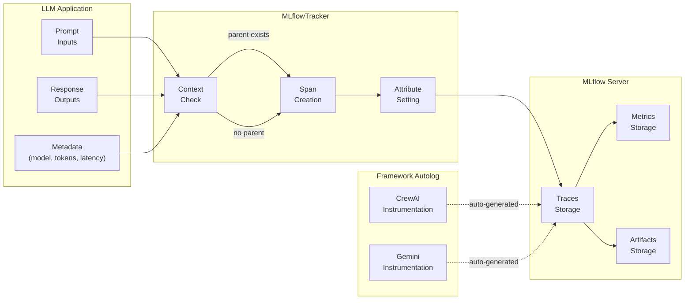

# Observability Module - Architecture

## Figure 1: Class Diagram — Protocol-Based Observability Layer

*Caption: Class hierarchy of the Observability module showing the `IExperimentTracker` protocol (11 methods), its concrete implementation `MLflowTracker`, and the `ModelArena` evaluation component. This is the richest Protocol in the Yantra system. All class and method names verified against source code.*

---

## Figure 2: Sequence Diagram — `log_llm_trace` Adaptive Span Logic

*Caption: Sequence diagram showing the conditional branching in `MLflowTracker.log_llm_trace()`. When a parent span exists, a child span is created and the parent receives metadata; otherwise, a new root trace is started. Verified against `mlflow_tracker.py:L54-L79`.*

---

## Figure 3: Component Diagram — Module Dependencies

*Caption: Component-level view showing the Observability module's external and internal dependencies. Verified via `import` statements in source files.*

---

## Figure 4: State Diagram — Experiment Run Lifecycle

*Caption: State machine showing the lifecycle of an MLflow experiment run managed by `MLflowTracker`, from initialization through active logging to completion.*

---

## Figure 5: Sequence Diagram — ModelArena Evaluation Flow

*Caption: Detailed sequence showing how `ModelArena.compare_models()` iterates over models, runs evaluation within tracked MLflow runs, and aggregates results into a comparison DataFrame.*

---

## Figure 6: Data Flow Diagram — Tracing Pipeline

*Caption: Shows how data flows from LLM API calls through the MLflowTracker to the MLflow tracking server, illustrating the tracing data pipeline.*

---

## Table 1: Protocol Method Coverage

*Caption: Complete enumeration of `IExperimentTracker` protocol methods with their categories and `MLflowTracker` implementation status. Source: `experiment_tracker_protocol.py:L7-L47`, `mlflow_tracker.py:L11-L92`.*

| S.No | Method | Category | Protocol (L#) | Implementation (L#) | MLflow SDK Call |
|:---:|:---|:---|:---|:---|:---|
| 1 | `start_run` | Lifecycle | L10 | L42 | `mlflow.start_run()` |
| 2 | `log_metric` | Logging | L12 | L45 | `mlflow.log_metric()` |
| 3 | `log_param` | Logging | L14 | L48 | `mlflow.log_param()` |
| 4 | `log_artifact` | Logging | L16 | L51 | `mlflow.log_artifact()` |
| 5 | `log_llm_trace` | Tracing | L18-L24 | L54-L79 | `mlflow.start_span()` |
| 6 | `start_span` | Tracing | L26-L28 | L81-L89 | `mlflow.start_span()` |
| 7 | `end_run` | Lifecycle | L30 | L91 | `mlflow.end_run()` |
| 8 | `autolog_crewai` | Autolog | L32 | L36 | `mlflow.crewai.autolog()` |
| 9 | `autolog_gemini` | Autolog | L34 | L39 | `mlflow.gemini.autolog()` |
| 10 | `enable_system_metrics` | System | L36-L38 | L16-L18 | `mlflow.enable_system_metrics_logging()` |
| 11 | `log_dataset` | Data | L40-L46 | L20-L34 | `mlflow.data.from_pandas()` |

---

## Table 2: MLflow API Surface Mapping

*Caption: Maps each MLflow API used by the module to its version requirement, category, and whether it's used in the tracker or arena.*

| S.No | MLflow API | Version | Used In | Category |
|:---:|:---|:---|:---|:---|
| 1 | `mlflow.set_tracking_uri()` | ≥1.0 | Tracker, Arena | Configuration |
| 2 | `mlflow.set_experiment()` | ≥1.0 | Tracker | Configuration |
| 3 | `mlflow.start_run()` | ≥1.0 | Tracker, Arena | Lifecycle |
| 4 | `mlflow.end_run()` | ≥1.0 | Tracker | Lifecycle |
| 5 | `mlflow.log_metric()` | ≥1.0 | Tracker | Logging |
| 6 | `mlflow.log_param()` | ≥1.0 | Tracker | Logging |
| 7 | `mlflow.log_artifact()` | ≥1.0 | Tracker | Logging |
| 8 | `mlflow.get_current_active_span()` | ≥2.14 | Tracker | Tracing |
| 9 | `mlflow.start_span()` | ≥2.14 | Tracker | Tracing |
| 10 | `mlflow.enable_system_metrics_logging()` | ≥2.8 | Tracker | System |
| 11 | `mlflow.data.from_pandas()` | ≥2.4 | Tracker | Data |
| 12 | `mlflow.log_input()` | ≥2.4 | Tracker | Data |
| 13 | `mlflow.evaluate()` | ≥2.8 | Arena | Evaluation |
| 14 | `mlflow.crewai.autolog()` | ≥2.14 | Tracker | Autolog |
| 15 | `mlflow.gemini.autolog()` | ≥2.14 | Tracker | Autolog |
| 16 | `mlflow.metrics.genai.answer_similarity()` | ≥2.12 | Arena | Metrics |
| 17 | `mlflow.metrics.genai.answer_relevance()` | ≥2.12 | Arena | Metrics |
| 18 | `mlflow.metrics.toxicity()` | ≥2.12 | Arena | Metrics |

---

## Table 3: Error Handling Strategy

*Caption: Error handling matrix showing how each component handles failures. Note the mixed approach: structured exceptions in tracker vs. silent degradation in dataset logging.*

| S.No | Component | Error Condition | Handling | Risk | Source |
|:---:|:---|:---|:---|:---|:---|
| 1 | `log_dataset` | Non-DataFrame input | `print()` warning | Silent data loss | `mlflow_tracker.py:L32` |
| 2 | `log_dataset` | Any exception | `print()` error, swallowed | No propagation | `mlflow_tracker.py:L34` |
| 3 | `log_llm_trace` | No active span | Creates new root (fallback) | None (by design) | `mlflow_tracker.py:L73` |
| 4 | `compare_models` | Evaluation failure | Uncaught exception | Partial results lost | `arena.py:L52` |
| 5 | `__init__` | Invalid URI | MLflow raises `MlflowException` | Crash at startup | `mlflow_tracker.py:L13` |

---

## Table 4: GenAI Metrics Inventory

*Caption: Complete specification of the LLM-as-a-Judge metrics used by ModelArena, including their evaluation approach, range, and interpretation.*

| S.No | Metric | Source | Judge Type | Range | Good Value | Measures |
|:---:|:---|:---|:---|:---|:---|:---|
| 1 | Answer Similarity | `answer_similarity()` | LLM-as-Judge | [1, 5] | ≥4 | Semantic overlap with ground truth |
| 2 | Answer Relevance | `answer_relevance()` | LLM-as-Judge | [1, 5] | ≥4 | Response relevance to question |
| 3 | Toxicity | `toxicity()` | Classifier | [0, 1] | <0.1 | Harmful content detection |

---

## Table 5: Architectural Design Decisions

*Caption: Key design decisions with rationale and trade-offs.*

| S.No | Decision | Rationale | Alternative | Trade-off |
|:---:|:---|:---|:---|:---|
| 1 | 11-method Protocol | Comprehensive MLOps coverage | Smaller interface | Complexity vs. completeness |
| 2 | Global MLflow state | MLflow SDK singleton design | Per-instance state | Simplicity vs. multi-tracker |
| 3 | `@contextmanager` for spans | Concise generator syntax | Class-based CM | Readability vs. flexibility |
| 4 | Autolog via monkey-patching | Zero-code instrumentation | Manual logging | Convenience vs. control |
| 5 | `print()` in `log_dataset` | Non-critical path, prevent crash | `logger.warning()` | Reliability vs. observability |
| 6 | `mlflow` import in Protocol | Used for type hints | Remove import (fix DIP) | Pragmatism vs. Clean Architecture |
| 7 | Arena as separate class | Evaluation ≠ tracking | Method on MLflowTracker | Separation of concerns |
| 8 | Thread-local span context | MLflow default | Explicit span passing | Convenience vs. async compatibility |
