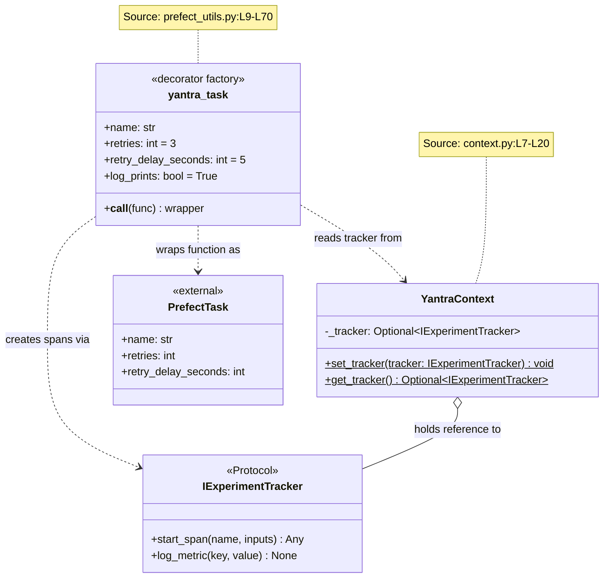
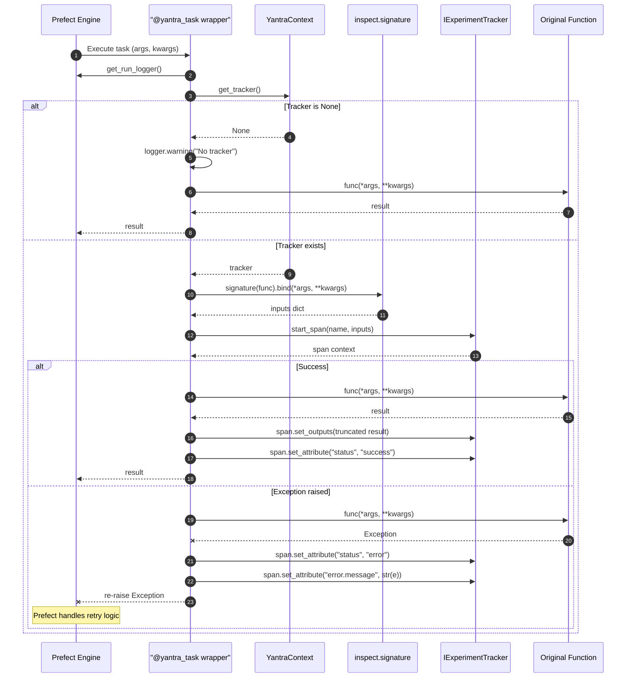
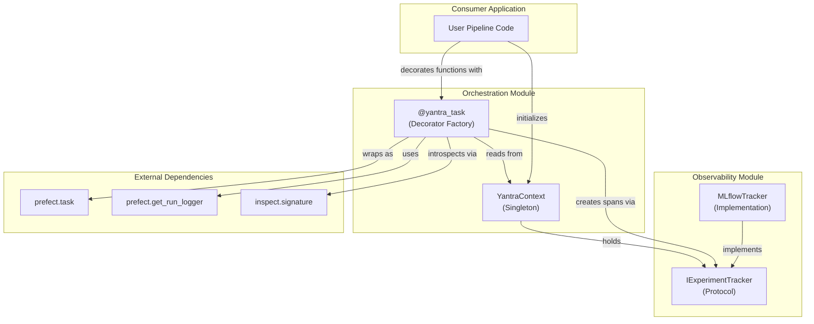

# Orchestration Module - Architecture

## Figure 1: Class Diagram — Orchestration Components

*Caption: Class diagram showing the `YantraContext` singleton, the `yantra_task` decorator factory, and the dependency on `IExperimentTracker` from the Observability module. All class and method names verified against source code.*

---

## Figure 2: Sequence Diagram — `@yantra_task` Execution Flow

*Caption: Sequence diagram showing the complete lifecycle of a function decorated with `@yantra_task`. Demonstrates the dual-context wrapping: Prefect task execution with MLflow span creation, argument introspection, and error handling. Verified against `prefect_utils.py:L30-L66`.*

---

## Figure 3: Component Diagram — Module Dependencies and External Integration

*Caption: Component-level view showing how the Orchestration module bridges the Observability module (via `IExperimentTracker`) with the Prefect SDK. Verified via `import` statements across all source files.*

---

## Table 1: Decorator Configuration Parameters

*Caption: Parameters accepted by the `@yantra_task` decorator factory, their defaults, and purpose. Source: `prefect_utils.py:L9-L14`.*

| S.No | Parameter | Type | Default | Purpose | Passed To |
|:---:|:---|:---|:---:|:---|:---|
| 1 | `name` | `str` | `None` | Task display name in Prefect UI | `prefect.task(name=)` |
| 2 | `retries` | `int` | 3 | Number of retry attempts on failure | `prefect.task(retries=)` |
| 3 | `retry_delay_seconds` | `int` | 5 | Delay between retries (seconds) | `prefect.task(retry_delay_seconds=)` |
| 4 | `log_prints` | `bool` | `True` | Capture `print()` statements as Prefect logs | `prefect.task(log_prints=)` |

---

## Table 2: Span Attributes Set by Decorator

*Caption: MLflow span attributes automatically set by the `@yantra_task` wrapper during execution. Source: `prefect_utils.py:L49-L66`.*

| S.No | Attribute | Value | Condition | Location |
|:---:|:---|:---|:---|:---|
| 1 | `inputs` | Bound function arguments | Always (when tracker exists) | L49 |
| 2 | `outputs.result` | `str(result)[:1000]` | On success | L56 |
| 3 | `status` | `"success"` | On success | L57 |
| 4 | `status` | `"error"` | On exception | L63 |
| 5 | `error.message` | `str(e)` | On exception | L64 |
