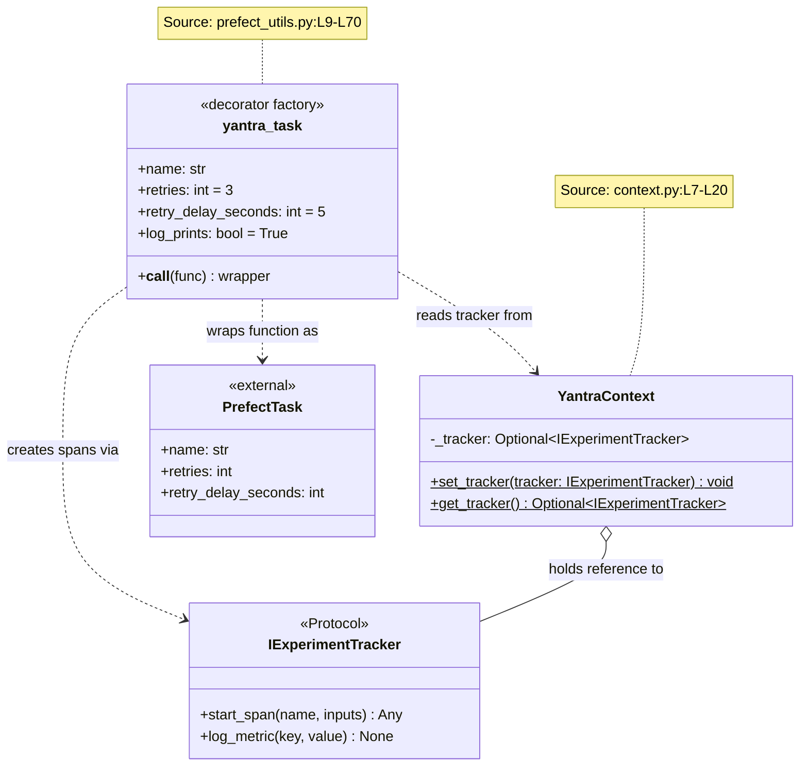
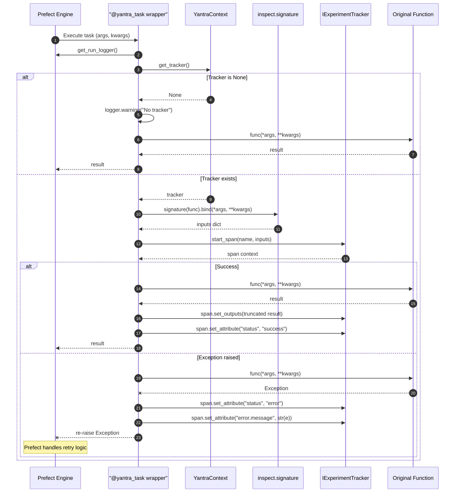
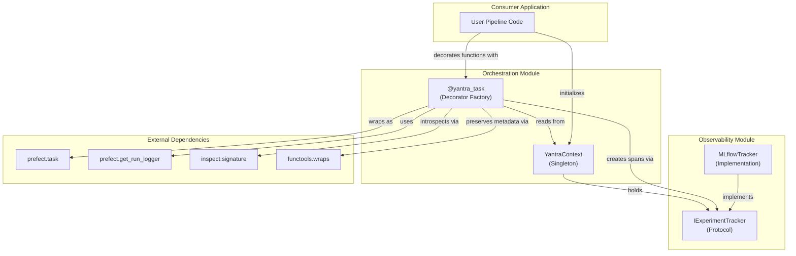
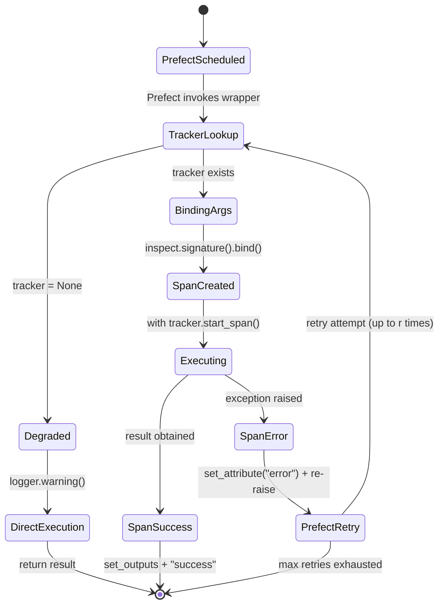
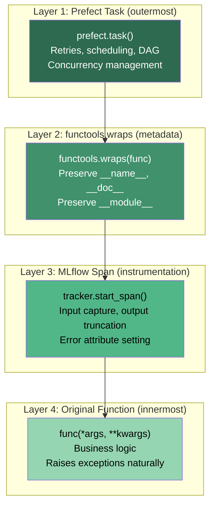
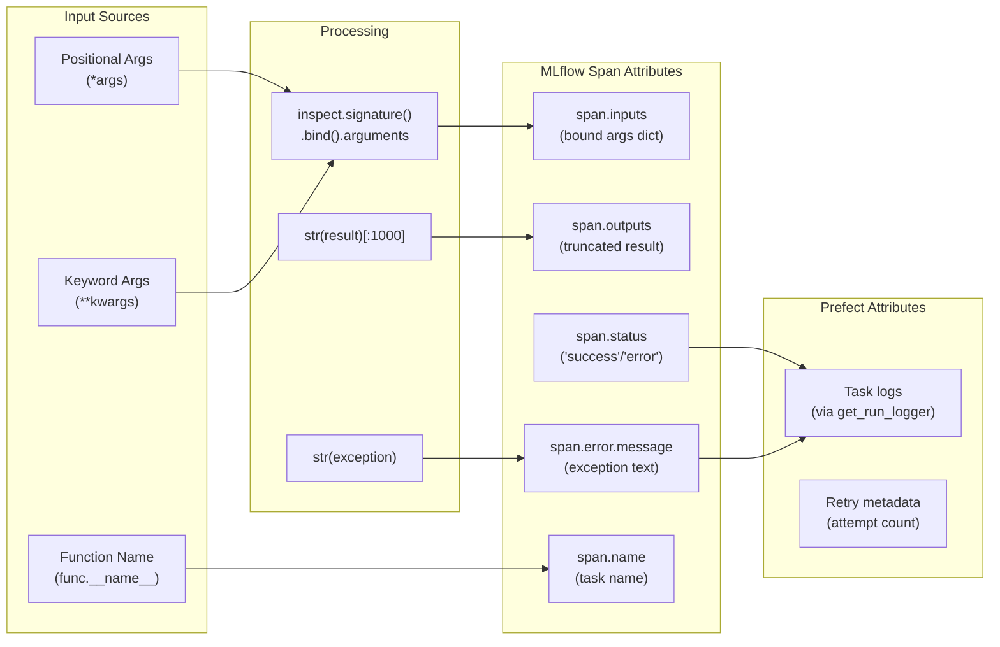

# Orchestration Module - Architecture

## Figure 1: Class Diagram — Orchestration Components

*Caption: Class diagram showing the `YantraContext` singleton, the `yantra_task` decorator factory, and the dependency on `IExperimentTracker` from the Observability module. This module is the only one in Yantra with a cross-module dependency. All class and method names verified against source code.*

---

## Figure 2: Sequence Diagram — `@yantra_task` Execution Flow

*Caption: Sequence diagram showing the complete lifecycle of a function decorated with `@yantra_task`. Demonstrates the dual-context wrapping: Prefect task execution with MLflow span creation, argument introspection, and error handling. Verified against `prefect_utils.py:L30-L66`.*

---

## Figure 3: Component Diagram — Module Dependencies and External Integration

*Caption: Component-level view showing how the Orchestration module bridges the Observability module (via `IExperimentTracker`) with the Prefect SDK. This is the only cross-module dependency in the Yantra system. Verified via `import` statements across all source files.*

---

## Figure 4: State Diagram — Decorated Task Lifecycle

*Caption: State machine showing all possible states of a `@yantra_task`-decorated function during execution, including the graceful degradation path and retry cycle.*

---

## Figure 5: Decorator Composition Stack

*Caption: Visual representation of the 3-layer decorator stack showing how `@yantra_task` composes Prefect task wrapping, MLflow span wrapping, and `functools.wraps` metadata preservation.*

---

## Figure 6: Data Flow Diagram — Information Captured per Task Run

*Caption: Shows what data flows through the decorator during each task execution, from raw function arguments to structured span attributes.*

---

## Table 1: Decorator Configuration Parameters

*Caption: Parameters accepted by the `@yantra_task` decorator factory, their defaults, and purpose. Source: `prefect_utils.py:L9-L14`.*

| S.No | Parameter | Type | Default | Purpose | Passed To |
|:---:|:---|:---|:---:|:---|:---|
| 1 | `name` | `str` | `None` | Task display name in Prefect UI | `prefect.task(name=)` |
| 2 | `retries` | `int` | 3 | Number of retry attempts on failure | `prefect.task(retries=)` |
| 3 | `retry_delay_seconds` | `int` | 5 | Delay between retries (seconds) | `prefect.task(retry_delay_seconds=)` |
| 4 | `log_prints` | `bool` | `True` | Capture `print()` statements as Prefect logs | `prefect.task(log_prints=)` |

---

## Table 2: Span Attributes Set by Decorator

*Caption: MLflow span attributes automatically set by the `@yantra_task` wrapper during execution. Source: `prefect_utils.py:L49-L66`.*

| S.No | Attribute | Value | Condition | Location |
|:---:|:---|:---|:---|:---|
| 1 | `inputs` | Bound function arguments | Always (when tracker exists) | L49 |
| 2 | `outputs.result` | `str(result)[:1000]` | On success | L56 |
| 3 | `status` | `"success"` | On success | L57 |
| 4 | `status` | `"error"` | On exception | L63 |
| 5 | `error.message` | `str(e)` | On exception | L64 |

---

## Table 3: Cross-Module Dependency Analysis

*Caption: The orchestration module's dependency on observability is the only inter-module dependency in Yantra, making it the system's integration point.*

| S.No | Import | From Module | Used In | Purpose |
|:---:|:---|:---|:---|:---|
| 1 | `IExperimentTracker` | `observability` | `context.py:L4` | Type annotation for tracker |
| 2 | `YantraContext` | `orchestration.context` | `prefect_utils.py:L6` | Tracker lookup |
| 3 | `task`, `get_run_logger` | `prefect` (external) | `prefect_utils.py:L4` | Workflow engine |
| 4 | `inspect` | stdlib | `prefect_utils.py:L3` | Argument binding |
| 5 | `functools` | stdlib | `prefect_utils.py:L2` | Metadata preservation |

---

## Table 4: Error Handling Strategy

*Caption: How errors are handled at each layer of the decorated function.*

| S.No | Error Source | Detection | Span Action | Prefect Action | Source |
|:---:|:---|:---|:---|:---|:---|
| 1 | Function exception | `except Exception as e` | Set "error" + message | Re-raise for retry | `prefect_utils.py:L61-L66` |
| 2 | Missing tracker | `if not tracker` | No span created | Standard execution | `prefect_utils.py:L43-L45` |
| 3 | Signature binding failure | `inspect.signature().bind()` | Not caught | `TypeError` propagated | `prefect_utils.py:L36` |

---

## Table 5: Architectural Design Decisions

*Caption: Key design decisions in the orchestration module with rationale and trade-offs.*

| S.No | Decision | Rationale | Alternative | Trade-off |
|:---:|:---|:---|:---|:---|
| 1 | Decorator factory pattern | Configurable retry/name params | Simple decorator | Flexibility vs. complexity |
| 2 | Class-level singleton context | Global DI without instance management | `contextvars.ContextVar` | Simplicity vs. thread safety |
| 3 | `@functools.wraps` inside `@task` | Preserve original function metadata | Omit wraps | Debuggability vs. none |
| 4 | Output truncation at 1000 chars | Prevent large spans | Configurable limit | Predictability vs. flexibility |
| 5 | Re-raise exception after logging | Preserve Prefect retry semantics | Swallow exception | Correctness vs. none |
| 6 | Bind args before tracker check | Always capture inputs | Lazy bind | Consistency vs. minor overhead |
| 7 | `YantraContext` not in `__init__.py` | Implementation detail exposure | Export it | Encapsulation vs. usability |
